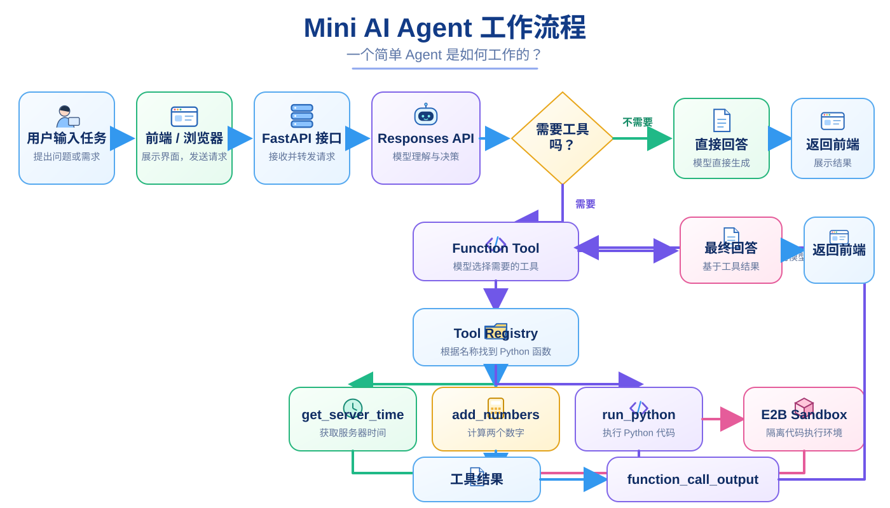
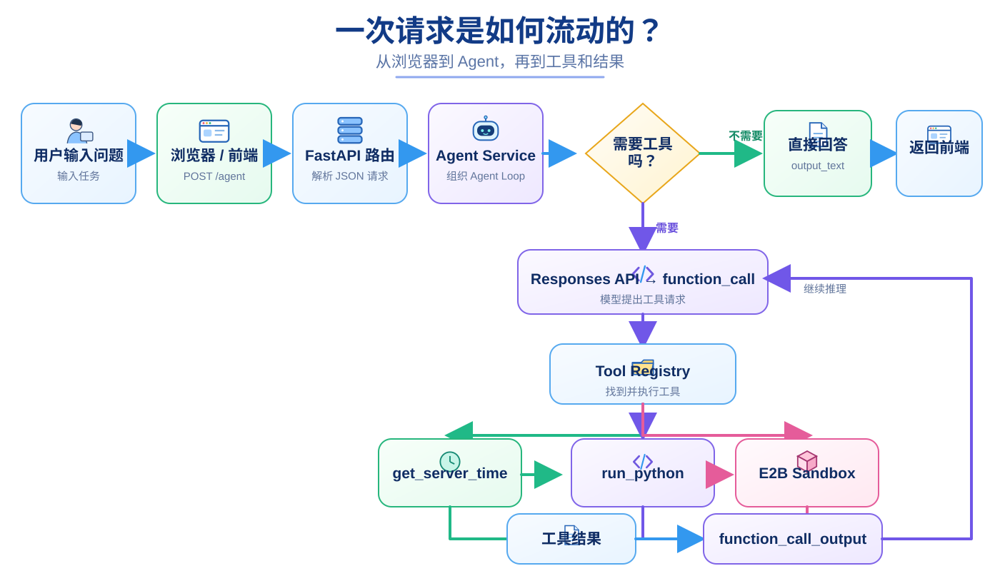
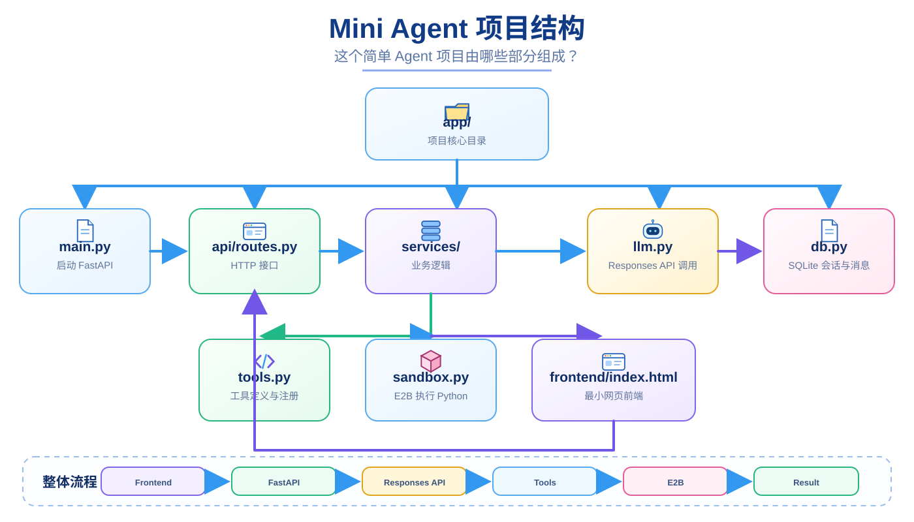
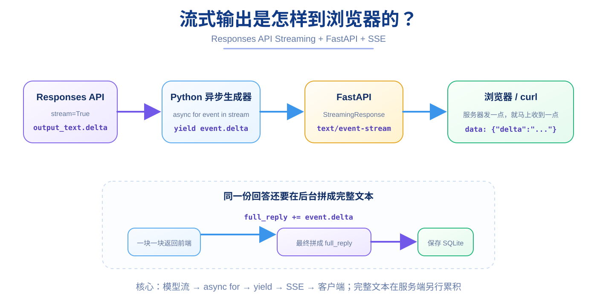
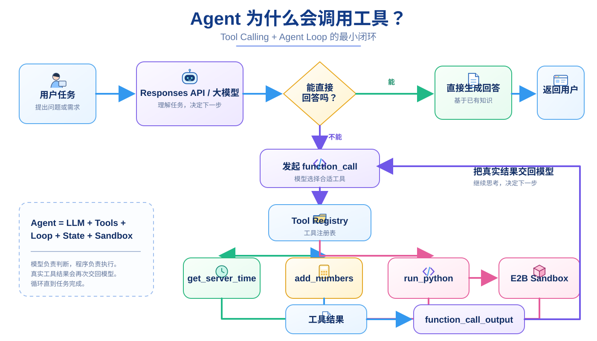
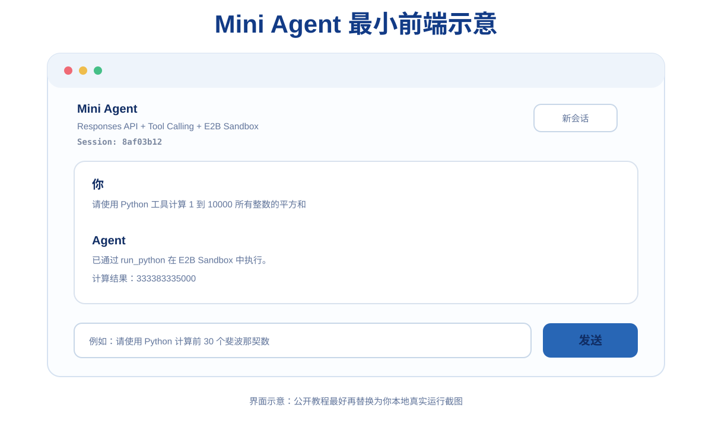

# 从 0 到 1 手写一个 Mini AI Agent

> 面向初学者：从 **Python + FastAPI** 开始，一步步写到 **Responses API、上下文、SQLite、流式输出、Tool Calling、Agent Loop、E2B Sandbox 和最小网页前端**。

这不是一个“复制最终代码就结束”的 Demo。

这份仓库更像一本很小的实战教材：我们会从最简单的 `print()` 开始，每次只增加一个新概念，并反复回答下面几个问题：

- 为什么现在需要它？
- 它解决了什么问题？
- 核心代码是什么意思？
- 正常运行后应该看到什么？
- 出错时应该从哪一层排查？
- 如果不看答案，你能不能自己再写一次？

**本项目不涉及数学建模。** 它实现的是一个通用、简化、适合学习底层原理的 AI Agent。

> 本教程统一使用 **Responses API**。如果你使用第三方 OpenAI-compatible API，请先确认供应商确实支持 Responses API；“兼容 OpenAI API”并不一定代表实现了所有接口。

---

## 最终你会做出什么？



学完后，你会亲手搭出下面这条完整链路：

```text
用户在浏览器输入任务
        ↓
JavaScript 发送 POST /agent
        ↓
FastAPI 接收 JSON 请求
        ↓
Agent Service 调用 Responses API
        ↓
模型判断是否需要工具
   ┌────┴────┐
   │         │
不需要      需要
   │         ↓
直接回答   function_call
             ↓
         Tool Registry
             ↓
       真正执行 Python 函数
             ↓
         工具真实结果
             ↓
     function_call_output
             ↓
        再交给模型
             ↓
      Agent Loop 继续
             ↓
          最终回答
             ↓
        返回浏览器
```

这里最重要的一句话是：

> **LLM 负责判断和选择动作；你的 Python 程序负责真正执行动作。**

---

## 适合谁？

这份教程适合：

- 会一点 Python，但没有写过完整后端；
- 知道大模型 API，却不知道 Agent 项目怎么组织；
- 一看到 `async/await`、FastAPI、数据库、Tool Calling 就觉得东西太多；
- 能运行别人的项目，但不知道如果从空文件夹开始应该怎么写；
- 想先搞懂 Agent 底层逻辑，再去学习 LangGraph、LangChain 或更大的开源项目。

我们**故意不使用 Agent 框架**，因为这里的目标不是记住某个框架 API，而是先看见 Agent 最核心的骨架。

---

## 最终项目结构

```text
mini--mm-agent/
├── .env.example
├── .gitignore
├── requirements.txt
├── main.py
│
├── app/
│   ├── __init__.py
│   ├── main.py
│   ├── config.py
│   ├── db.py
│   ├── llm.py
│   ├── tools.py
│   ├── sandbox.py
│   │
│   ├── api/
│   │   ├── __init__.py
│   │   └── routes.py
│   │
│   └── services/
│       ├── __init__.py
│       ├── response_service.py
│       └── agent_service.py
│
├── frontend/
│   └── index.html
│
└── docs/
    ├── SCREENSHOTS.md
    └── images/
```

仓库中放的是**最终版本代码**。学习时建议按照下面的章节一步一步写，不要一开始就把所有最终代码复制过去。

---

## 20 章学习路线

| 阶段 | 章节 | 最终获得的能力 |
| --- | --- | --- |
| 环境与 Python | 1–3 | WSL、VSCode、虚拟环境、运行 Python |
| Web 基础 | 4–6 | FastAPI、GET/POST、JSON、`.env` |
| LLM 应用 | 7–11 | Responses API、多轮状态、SQLite、Reset |
| 工程化 | 12–14 | 分层、async/await、日志、SSE 流式输出 |
| Agent 核心 | 15–18 | Function Tool、Tool Registry、Agent Loop |
| 安全执行与产品串联 | 19–20 | E2B Sandbox、网页前端、完整 Agent |

---

# 第 1 章：Windows + WSL + VSCode —— 先把开发环境接通

> **本章目标**：让 Windows 上的 VSCode 真正连接到 WSL Ubuntu。  
> **完成效果**：VSCode 左下角显示 `WSL: Ubuntu...`，终端路径位于 `/home/...`。  
> **核心知识**：Windows 与 WSL 的关系、Linux 文件系统、VSCode 远程开发。

你的电脑虽然是 Windows，但我们希望真正的开发环境是：

```text
Windows
│
├── VSCode 图形界面
│     ↓ WSL 扩展
│
└── WSL Ubuntu
      ├── 项目文件
      ├── Python
      ├── pip
      ├── Git
      └── Terminal
```

VSCode 可以把界面运行在 Windows，同时让当前工作区和程序真正运行在 Ubuntu 中。

## 1.1 连接 WSL

Windows VSCode 安装 Microsoft 官方 **WSL** 扩展，然后：

```text
Ctrl + Shift + P
→ WSL: Connect to WSL
→ Ubuntu-24.04（或你的 Ubuntu 版本）
```

正常情况下 VSCode 左下角会显示：

```text
WSL: Ubuntu-24.04
```

打开：

```text
Terminal → New Terminal
```

运行：

```bash
pwd
python3 --version
git --version
```

`pwd` 应该类似：

```text
/home/yourname
```

如果看到 `C:\...`，说明你开的还是 Windows Terminal。

## 1.2 为什么项目建议放 `/home/...`？

WSL 虽然也能访问 `/mnt/c/...`，但初学阶段建议把项目放在：

```text
/home/你的用户名/
```

这样路径、权限、虚拟环境和以后 Linux 部署的思维更一致。

## 1.3 Python 扩展也要在 WSL 中启用

连接 WSL 后，在 Extensions 中搜索 Microsoft 官方 **Python**。

如果看到：

```text
Install in WSL: Ubuntu-24.04
```

就点击安装。

### 本章检查

```text
[ ] VSCode 左下角显示 WSL: Ubuntu
[ ] pwd 输出 /home/你的用户名
[ ] python3 --version 正常
[ ] git --version 正常
```

### 小练习

```bash
pwd
whoami
ls
```

尝试解释这三个命令分别在回答什么问题。

---

# 第 2 章：创建项目与 Python 虚拟环境 —— 给项目一个独立的小房间

> **本章目标**：创建项目目录和独立 Python 环境。  
> **完成效果**：终端出现 `(.venv)`，`which python` 指向项目里的 `.venv/bin/python`。  
> **核心知识**：venv、依赖隔离、Python Interpreter。

## 2.1 创建项目

```bash
cd ~
mkdir mini--mm-agent
cd mini--mm-agent
pwd
```

应该类似：

```text
/home/yourname/mini--mm-agent
```

## 2.2 为什么需要 `.venv`？

不同 Python 项目可能需要不同版本的第三方包。

虚拟环境相当于：

```text
mini--mm-agent/
└── .venv/
    ├── 自己的 python
    ├── 自己的 pip
    └── 自己安装的依赖
```

创建：

```bash
python3 -m venv .venv
```

激活：

```bash
source .venv/bin/activate
```

检查：

```bash
which python
python --version
which pip
```

正确的 `python` 路径应该位于：

```text
.../mini--mm-agent/.venv/bin/python
```

如果 Ubuntu 缺少 venv：

```bash
sudo apt update
sudo apt install python3-venv
```

## 2.3 让 VSCode 选择同一个解释器

```text
Ctrl + Shift + P
→ Python: Select Interpreter
→ ./.venv/bin/python
```

其他项目也可以叫 `.venv`，因为真正完整路径不同，所以不会冲突。

### 小练习

```bash
deactivate
source .venv/bin/activate
```

观察终端前 `(.venv)` 的变化。

---

# 第 3 章：运行第一个 Python 文件 —— 先证明最基础链路是通的

> **本章目标**：创建源码目录并运行第一个 Python 程序。  
> **完成效果**：终端输出 `Hello Mini Agent`。  
> **核心知识**：Python 文件、保存、逐层验证。

创建：

```bash
mkdir app
touch app/main.py
```

`app/main.py`：

```python
print("Hello Mini Agent")
```

记得：

```text
Ctrl + S
```

然后运行：

```bash
python app/main.py
```

应该得到：

```text
Hello Mini Agent
```

如果 VSCode 标签旁边还有小圆点，说明文件可能还没有保存。Python 执行的是磁盘中的文件，而不是尚未保存的编辑器内容。

这一章看起来非常简单，但它建立了一个重要开发习惯：

```text
先验证 Python
↓
再验证 FastAPI
↓
再验证 HTTP
↓
再验证模型
↓
再验证 Tool
↓
最后组合 Agent
```

---

# 第 4 章：第一次启动 FastAPI —— 把 Python 函数变成 Web API

> **本章目标**：让浏览器可以访问 Python 后端。  
> **完成效果**：浏览器访问 `127.0.0.1:8001` 能看到 JSON，并能打开 `/docs`。  
> **核心知识**：FastAPI、Uvicorn、Route、端口。

安装：

```bash
pip install fastapi uvicorn
```

把 `app/main.py` 改成：

```python
from fastapi import FastAPI


app = FastAPI()


@app.get("/")
def home():
    return {
        "message": "Hello Mini Agent"
    }
```

运行：

```bash
uvicorn app.main:app --reload --port 8001
```

浏览器打开：

```text
http://127.0.0.1:8001
http://127.0.0.1:8001/docs
```

`uvicorn app.main:app` 可以拆成：

```text
uvicorn
→ 启动 Web Server

app.main
→ 找 app/main.py

:app
→ 找 main.py 中的 app = FastAPI()
```

`@app.get("/")` 可以先读成人话：

> 当有人用 GET 请求访问 `/`，执行下面的 `home()`。

而 Python 字典返回值会被 FastAPI 转成 JSON 响应。

如果端口被占用：

```bash
ss -ltnp | grep :8001
```

或者临时使用 8002。

### 小练习

新增：

```python
@app.get("/hello")
def hello():
    return {"message": "Hello from /hello"}
```

然后观察 `/docs` 是否多出一个接口。

---

# 第 5 章：GET、POST、Header 和 JSON —— 数据到底怎么进入后端？

> **本章目标**：写出第一个接收 JSON 的 POST API。  
> **完成效果**：能用 Swagger 和 curl 向 `/responses` 发送 JSON。  
> **核心知识**：HTTP Method、URL、Header、Body、Pydantic、状态码。

浏览器地址栏默认发送 GET。

但如果用户要把一份数据交给服务器处理，例如：

```json
{
  "input": "你好"
}
```

我们使用 POST。

一个 HTTP 请求先认识四部分：

```text
Method  → POST
URL     → /responses
Headers → Content-Type: application/json
Body    → {"input":"你好"}
```

修改 `app/main.py`：

```python
from fastapi import FastAPI
from pydantic import BaseModel


app = FastAPI()


class ResponseRequest(BaseModel):
    input: str


@app.get("/")
def home():
    return {"message": "Hello Mini Agent"}


@app.post("/responses")
def create_response(request: ResponseRequest):
    return {
        "output": f"你输入了：{request.input}"
    }
```

`BaseModel` 在告诉 FastAPI：

> 请求 Body 必须有一个字符串类型的 `input` 字段。

打开 `/docs`，发送：

```json
{
  "input": "你好，我正在学习 Agent"
}
```

正常返回 200。

也可以用 curl：

```bash
curl -X POST http://127.0.0.1:8001/responses \
  -H "Content-Type: application/json" \
  -d '{"input":"你好，我是从终端发过来的"}'
```

这里：

```text
-X POST → Method
URL     → 请求地址
-H      → Header
-d      → Body
```

常见状态码：

```text
200 → 成功
404 → 路径/资源没找到
405 → Method 不允许
422 → 请求数据没通过验证
500 → 服务器内部代码出错
```

如果把 `-X` 写成小写 `-x`，curl 会把 `POST` 当作代理地址，可能报：

```text
Could not resolve proxy: POST
```

### 小练习

把请求模型临时改成：

```python
class ResponseRequest(BaseModel):
    input: str
    user_name: str
```

自己修改 Swagger JSON，让返回值中包含名字。练习完成后恢复为只有 `input`。

---

# 第 6 章：`.env` —— 把“配置”和“源码”分开

> **本章目标**：让程序从 `.env` 读取 API Key、Base URL 和模型名。  
> **完成效果**：Python 能读出配置，但真实密钥不会进入 GitHub。  
> **核心知识**：环境变量、dotenv、`.env.example`、`.gitignore`、秘密管理。

从这一章开始，我们马上要调用真正的大模型 API。

程序至少需要知道：

```text
API_KEY
→ 调用权限

BASE_URL
→ API 服务地址

MODEL_NAME
→ 使用哪个模型
```

后面使用 E2B 时还会增加 `E2B_API_KEY`。

安装：

```bash
pip install python-dotenv
```

项目根目录创建 `.env`：

```env
API_KEY=test-key
BASE_URL=https://example.com/v1
MODEL_NAME=test-model
E2B_API_KEY=
```

创建 `app/config.py`：

```python
import os

from dotenv import load_dotenv


load_dotenv()

API_KEY = os.getenv("API_KEY")
BASE_URL = os.getenv("BASE_URL")
MODEL_NAME = os.getenv("MODEL_NAME")
E2B_API_KEY = os.getenv("E2B_API_KEY")
```

测试：

```bash
python -c "from app.config import MODEL_NAME; print(MODEL_NAME)"
```

应该输出：

```text
test-model
```

`.env` 中通常不需要给普通字符串加引号：

```env
MODEL_NAME=test-model
```

如果包含空格，也可以使用英文双引号。不要使用中文弯引号。

创建 `.gitignore`：

```gitignore
.venv/
.env
__pycache__/
*.pyc
chat.db
```

再创建可以提交到 GitHub 的 `.env.example`：

```env
API_KEY=
BASE_URL=https://api.openai.com/v1
MODEL_NAME=your-responses-compatible-model
E2B_API_KEY=
```

所以：

```text
.env
→ 真实本地配置，不提交

.env.example
→ 告诉别人需要配置哪些字段，可以提交
```

完成测试后，把 `.env` 改成你的真实模型配置。

> 不要把 API Key 打印在截图、Issue、README 或日志里。

---

# 第 7 章：第一次调用 Responses API —— 让 Python 真正和大模型说上话

> **本章目标**：暂时不做 Agent，只验证 Python 可以调用大模型。  
> **完成效果**：终端打印模型真实返回的文字。  
> **核心知识**：SDK、Client、Responses API、`model`、`instructions`、`input`、`output_text`。

安装：

```bash
pip install openai
```

创建 `app/llm.py`，先写最简单的同步版本：

```python
from openai import OpenAI

from app.config import API_KEY, BASE_URL, MODEL_NAME


client = OpenAI(
    api_key=API_KEY,
    base_url=BASE_URL,
)


def ask_model(user_input: str):
    response = client.responses.create(
        model=MODEL_NAME,
        instructions="你是一个简洁、清楚的 AI 助手。",
        input=user_input,
    )

    return response.output_text
```

这里：

```text
client
→ 模型 API 客户端

model
→ 使用哪个模型

instructions
→ 模型应该怎么工作

input
→ 当前用户真正的问题

response.output_text
→ 聚合后的文本回答
```

测试：

```bash
python -c "from app.llm import ask_model; print(ask_model('你好，请只回答：连接成功'))"
```

如果看到正常模型回答，说明：

```text
.env
↓
config.py
↓
llm.py
↓
Responses API
↓
模型
↓
output_text
```

已经打通。

如果是第三方 OpenAI-compatible 服务，必须确认它真的支持 Responses API；“兼容 OpenAI”不等于所有接口和字段都兼容。

---

# 第 8 章：把 Responses API 接进 FastAPI —— 从脚本变成 AI 后端

> **本章目标**：让 `POST /responses` 返回真实模型回答。  
> **完成效果**：Swagger 提交一句话，后端调用模型并返回结果。  
> **核心知识**：HTTP → FastAPI → 模型 API、同步与异步、LLM Gateway。



现在我们已经分别验证了：

```text
POST /responses 可以收 JSON
```

和：

```text
Python 可以调用 Responses API
```

现在把两条链拼起来。

模型 API 是网络 I/O，因此从这里开始使用 `AsyncOpenAI`：

```python
from openai import AsyncOpenAI

from app.config import API_KEY, BASE_URL, MODEL_NAME


client = AsyncOpenAI(
    api_key=API_KEY,
    base_url=BASE_URL,
)


DEFAULT_INSTRUCTIONS = (
    "你是一个简洁、清楚的 AI 助手。"
)


async def create_model_response(
    input_data,
    *,
    instructions: str = DEFAULT_INSTRUCTIONS,
    previous_response_id: str | None = None,
):
    kwargs = {
        "model": MODEL_NAME,
        "instructions": instructions,
        "input": input_data,
    }

    if previous_response_id:
        kwargs["previous_response_id"] = previous_response_id

    return await client.responses.create(**kwargs)
```

再让 Route 变成异步：

```python
@app.post("/responses")
async def create_response(request: ResponseRequest):
    response = await create_model_response(
        request.input
    )

    return {
        "output": response.output_text
    }
```

现在的两段网络通信是：

```text
客户端 → 你的 FastAPI
```

以及：

```text
你的 FastAPI → 模型 API
```

不是同一条请求。

---

# 第 9 章：多轮对话与 `previous_response_id` —— 模型为什么能继续上一轮？

> **本章目标**：让第二次模型请求可以继续第一轮上下文。  
> **完成效果**：先告诉模型一个信息，下一轮能基于上一轮回答。  
> **核心知识**：Response ID、conversation state、`previous_response_id`。

第一次：

```python
first = await create_model_response(
    "我叫小明，请记住我的名字。"
)
```

拿到：

```python
first.id
```

第二次：

```python
second = await create_model_response(
    "我叫什么名字？",
    previous_response_id=first.id,
)
```

这里的 `previous_response_id` 不是上一条回答文本，而是：

> 上一轮 Response 对象的 ID。

所以可以把它理解成一条“继续上一轮上下文”的指针。

真实 Web 应用还需要自己的 `session_id`：

```text
session-a → resp_111
session-b → resp_999
```

否则所有用户共用一个全局 `previous_response_id` 就会串会话。

> 使用 `previous_response_id` 时，本教程每次仍然重新传当前 `instructions`。不要把上一轮的 instructions 当成自动永久继承的应用配置。

---

# 第 10 章：SQLite 保存 Session 与消息 —— 把状态从内存放到硬盘

> **本章目标**：保存 `session_id → previous_response_id`，并记录本地消息历史。  
> **完成效果**：服务器重启后数据库仍然存在。  
> **核心知识**：SQLite、表、持久化、SELECT / INSERT / DELETE。

我们保存两张表：

```text
sessions
→ session_id 对应最新 previous_response_id

messages
→ 本地 user / assistant 消息
```

数据库位置：

```python
DB_PATH = Path(__file__).resolve().parent.parent / "chat.db"
```

初始化：

```python
def init_db():
    with sqlite3.connect(DB_PATH) as conn:
        conn.execute("""
            CREATE TABLE IF NOT EXISTS messages (
                id INTEGER PRIMARY KEY AUTOINCREMENT,
                session_id TEXT NOT NULL,
                role TEXT NOT NULL,
                content TEXT NOT NULL
            )
        """)

        conn.execute("""
            CREATE TABLE IF NOT EXISTS sessions (
                session_id TEXT PRIMARY KEY,
                previous_response_id TEXT
            )
        """)
```

请求现在增加：

```python
class ResponseRequest(BaseModel):
    session_id: str
    input: str
```

每次请求的核心流程：

```text
查 session 对应 previous_response_id
↓
调用模型
↓
保存 user 消息
↓
保存 assistant 消息
↓
更新最新 response.id
```

可以直接使用 sqlite3 CLI 查看真实数据：

```bash
sqlite3 chat.db
```

```sql
.tables
SELECT * FROM sessions;
SELECT * FROM messages;
.quit
```

如果出现 `no such table`，第一件事先执行：

```bash
pwd
```

确认你打开的是项目根目录的 `chat.db`，而不是在其他目录误创建了新的空数据库。

---

# 第 11 章：Reset —— “开始新会话”到底是在清什么？

> **本章目标**：给用户一个明确的方法，主动结束当前上下文链并开始新会话。  
> **完成效果**：调用 `POST /responses/reset` 后，同一个 `session_id` 再提问时不再沿用旧的 `previous_response_id`。  
> **核心知识**：Session 生命周期、状态清理、DELETE、应用状态与模型服务端状态的区别。

到这里，我们已经能让一个 `session_id` 持续对话。

这很好，但很快会遇到一个真实问题：

```text
我刚才在聊 Python
↓
现在我想开始一个完全新的主题
↓
旧上下文还要继续带着吗？
```

很多聊天产品里的：

```text
新对话
New Chat
Reset
```

本质上都在解决类似问题。

---

## 11.1 先回忆：我们当前到底保存了什么状态？

SQLite 中有两部分：

```text
messages
→ 我们自己保存的历史消息

sessions
→ session_id 对应的 latest previous_response_id
```

假设：

```text
session_id = user-a
```

数据库里可能是：

```text
sessions
user-a → resp_abc123
```

同时 `messages` 中还有：

```text
user-a | user      | 我叫小明
user-a | assistant | 你好小明
user-a | user      | 我叫什么？
user-a | assistant | 你叫小明
```

如果要真正从“本应用的角度”开始一段新会话，我们至少需要：

```text
1. 不再继续旧 previous_response_id
2. 清掉本地旧消息历史
```

所以 Reset 不是一句神秘命令。

它就是：

```text
DELETE messages
+
DELETE session pointer
```

---

## 11.2 在 `app/db.py` 中增加 `clear_session()`

打开：

```text
app/db.py
```

增加：

```python
def clear_session(session_id: str):
    with sqlite3.connect(DB_PATH) as conn:
        conn.execute(
            "DELETE FROM messages WHERE session_id = ?",
            (session_id,),
        )

        conn.execute(
            "DELETE FROM sessions WHERE session_id = ?",
            (session_id,),
        )
```

先别急着复制完就跳过，我们逐句看。

### 第一条 DELETE

```sql
DELETE FROM messages
WHERE session_id = ?
```

意思：

> 删除这个 session 的本地消息。

### 第二条 DELETE

```sql
DELETE FROM sessions
WHERE session_id = ?
```

意思：

> 删除这个 session 保存的 previous_response_id 指针。

所以 Reset 后下一次执行：

```python
get_previous_response_id(session_id)
```

会得到：

```python
None
```

于是下一次 Responses API 请求不会继续旧链。

---

## 11.3 为什么不是把 `previous_response_id` 改成空字符串？

理论上你可以设计成：

```text
session-a | ""
```

但删除整行通常更自然。

因为：

```text
没有这一行
→ 这是一个还没有历史的 session
```

状态更容易理解。

---

## 11.4 定义 Reset 请求格式

我们仍然需要知道：

> 到底要重置哪个 session？

所以在 `app/main.py` 临时增加：

```python
class ResetRequest(BaseModel):
    session_id: str
```

它期待：

```json
{
  "session_id": "user-a"
}
```

---

## 11.5 增加 `/responses/reset`

导入：

```python
from app.db import clear_session
```

然后增加：

```python
@app.post("/responses/reset")
def reset_response(request: ResetRequest):
    clear_session(request.session_id)

    return {
        "message": "session reset"
    }
```

这里我们故意使用 POST，而不是 GET。

因为这个请求不是单纯“读取状态”，而是在**修改服务器状态**：它会删除数据库中的内容。

---

## 11.6 按固定顺序测试 Reset

打开：

```text
http://127.0.0.1:8001/docs
```

第一步：

```json
{
  "session_id": "reset-test",
  "input": "我叫小明，请记住我的名字。"
}
```

第二步：

```json
{
  "session_id": "reset-test",
  "input": "我叫什么名字？"
}
```

正常应该能继续上下文。

第三步调用：

```text
POST /responses/reset
```

Body：

```json
{
  "session_id": "reset-test"
}
```

应该得到：

```json
{
  "message": "session reset"
}
```

第四步，再调用 `/responses`：

```json
{
  "session_id": "reset-test",
  "input": "我叫什么名字？"
}
```

现在模型应该不知道你之前说过“小明”。

---

## 11.7 Reset 后直接去数据库看

进入：

```bash
sqlite3 chat.db
```

查询：

```sql
SELECT *
FROM sessions
WHERE session_id = 'reset-test';
```

应该查不到对应行。

再：

```sql
SELECT *
FROM messages
WHERE session_id = 'reset-test';
```

也应该为空。

这时候你就能把：

```text
API 行为
```

和：

```text
数据库真实变化
```

对应起来。

---

## 11.8 一个非常重要的边界：Reset 不一定等于删除模型供应商保存的数据

我们当前的 `reset` 做的是：

```text
删除本地 messages
删除本地 previous_response_id
```

也就是：

> **我们的应用以后不再继续引用旧 Response 链。**

这不应该自动理解成：

> “远端模型服务已经永久删除了所有旧 Response 数据。”

模型供应商是否存储 Response、保存多久、如何删除，是另一层 API 和数据政策问题。

所以以后做真实产品时要区分：

```text
应用里的“新会话”
```

和：

```text
远端数据删除 / 隐私删除请求
```

不是同一个动作。

---

### 第 11 章检查清单

```text
[ ] db.py 有 clear_session()
[ ] Reset 同时清理 messages 和 sessions
[ ] /responses/reset 能在 Swagger 中调用
[ ] Reset 后 get_previous_response_id 会返回 None
[ ] Reset 后模型不再沿用旧上下文
[ ] 知道“开始新会话”和“删除供应商端数据”不是同一概念
```

### 本章小练习

增加一个临时接口：

```text
GET /debug/session/{session_id}
```

让它只返回这个 session 当前的：

```text
previous_response_id
```

然后观察 Reset 前后有什么变化。

练习完成后建议删除这个 Debug 接口，避免正式项目随便暴露内部状态。

### 你现在应该能回答

> 为什么 Reset 需要同时清理 `messages` 和 `previous_response_id`？只删其中一个会发生什么？

---

# 第 12 章：把代码拆开 —— 从“一个能跑的 main.py”到真正项目结构

> **本章目标**：把越来越长的 `main.py` 拆成职责清晰的模块。  
> **完成效果**：`main.py` 只负责组装应用，Route、业务逻辑、模型调用、数据库各自放在合适位置。  
> **核心知识**：Refactor、APIRouter、Service、Gateway、职责分离、Composition Root。



到第 11 章为止，如果你一直跟着写，`app/main.py` 里已经开始同时出现：

```text
FastAPI 创建
Pydantic Request Model
GET /
POST /responses
POST /responses/reset
数据库查询
模型调用
消息保存
```

它还能跑。

但如果继续把 Streaming、Tool Calling、Agent Loop 全部塞进去，最终会变成：

```text
main.py
├── 路由
├── 数据库
├── 模型
├── Tool
├── Agent Loop
├── 日志
├── E2B
└── 越来越难找东西
```

所以现在第一次进行真正的 **Refactor（重构）**。

重构的核心目标是：

> **改变代码组织方式，但不故意改变原有功能。**

---

## 12.1 先理解“按职责拆”，而不是“为了文件多而拆”

我们希望最终变成：

```text
app/main.py
→ 应用怎么启动、怎么组装

app/api/routes.py
→ HTTP 世界：URL、GET、POST、请求与响应

app/services/response_service.py
→ 一次普通模型请求的业务流程

app/llm.py
→ 怎么调用模型供应商

app/db.py
→ 怎么读写 SQLite
```

未来再加入：

```text
app/services/agent_service.py
→ Agent Loop

app/tools.py
→ Tool 定义和 Registry

app/sandbox.py
→ E2B
```

先记住一句：

> **拆文件不是目的，让每个模块只关心自己的问题才是目的。**

---

## 12.2 创建目录

在项目根目录：

```bash
mkdir -p app/api app/services
```

创建 Python package 标记文件：

```bash
touch app/api/__init__.py
touch app/services/__init__.py
```

再创建：

```bash
touch app/api/routes.py
touch app/services/response_service.py
```

现在结构：

```text
app/
├── main.py
├── config.py
├── llm.py
├── db.py
│
├── api/
│   ├── __init__.py
│   └── routes.py
│
└── services/
    ├── __init__.py
    └── response_service.py
```

---

## 12.3 为什么要有 `__init__.py`？

在现代 Python 中，一些场景下没有它也能工作。

但教学项目里显式放：

```text
__init__.py
```

可以很清楚地表达：

> “这个目录属于 Python package。”

以后你会经常看到：

```python
from app.services.response_service import respond
```

这种包导入。

---

## 12.4 把普通 Responses 业务搬进 Service

创建：

```text
app/services/response_service.py
```

写：

```python
from app.db import (
    clear_session,
    get_previous_response_id,
    save_message,
    set_previous_response_id,
)
from app.llm import create_model_response


async def respond(session_id: str, user_input: str):
    previous_response_id = get_previous_response_id(
        session_id
    )

    response = await create_model_response(
        user_input,
        previous_response_id=previous_response_id,
    )

    reply = response.output_text

    save_message(session_id, "user", user_input)
    save_message(session_id, "assistant", reply)
    set_previous_response_id(session_id, response.id)

    return reply


def reset_response_session(session_id: str):
    clear_session(session_id)
```

### 这层 Service 解决什么问题？

`respond()` 负责的是一条完整“业务流程”：

```text
根据 session 查上下文
↓
调用模型
↓
取得文本
↓
保存两条消息
↓
更新 response id
↓
返回 reply
```

它不是 HTTP，也不是 SQL，更不是 SDK 初始化。

它负责的是：

> **“一次普通 AI 回答在我们应用里应该怎么完成？”**

这就是 Service 很常见的意义。

---

## 12.5 把 HTTP 接口搬到 `routes.py`

创建：

```text
app/api/routes.py
```

写：

```python
from fastapi import APIRouter
from pydantic import BaseModel

from app.services.response_service import (
    reset_response_session,
    respond,
)


router = APIRouter()


class ResponseRequest(BaseModel):
    session_id: str
    input: str


class ResetRequest(BaseModel):
    session_id: str


@router.get("/")
def home():
    return {
        "message": "Mini Agent is running"
    }


@router.post("/responses")
async def create_response(request: ResponseRequest):
    reply = await respond(
        request.session_id,
        request.input,
    )

    return {
        "output": reply
    }


@router.post("/responses/reset")
def reset_response(request: ResetRequest):
    reset_response_session(
        request.session_id
    )

    return {
        "message": "session reset"
    }
```

注意这里从：

```python
@app.post(...)
```

变成：

```python
@router.post(...)
```

---

## 12.6 `APIRouter` 到底是什么？

可以把：

```python
router = APIRouter()
```

理解成：

> 一个专门收集一组 API Route 的“小路由盒子”。

我们先把：

```text
GET /
POST /responses
POST /responses/reset
```

注册到 `router`。

然后再由主 FastAPI 应用统一把这个 `router` 装进去。

这样 API 数量越来越多时，就不用全部写在 `main.py`。

---

## 12.7 让 `main.py` 只负责“组装”

把 `app/main.py` 改成：

```python
from fastapi import FastAPI

from app.api.routes import router
from app.db import init_db


app = FastAPI(
    title="Mini Agent - Responses API"
)

init_db()

app.include_router(router)
```

关键：

```python
app.include_router(router)
```

可以理解成：

> 把 `routes.py` 里收集的那一组 API 接入主应用。

现在：

```text
main.py
```

终于不再负责所有细节。

---

## 12.8 现在一次请求怎么走？

用户调用：

```text
POST /responses
```

路线：

```text
app/main.py
↓ include_router
app/api/routes.py
↓ respond(...)
app/services/response_service.py
├─ app/db.py
└─ app/llm.py
```

以后排错时也开始有方向：

```text
URL / 请求格式不对
→ 看 routes.py

模型业务顺序不对
→ 看 response_service.py

Responses API 配置不对
→ 看 llm.py

SQLite 数据不对
→ 看 db.py
```

这就是项目分层带来的直接价值。

---

## 12.9 为什么 `main.py` 可以叫 Composition Root？

这是一个以后会经常遇到的工程词。

我们现在的 `main.py` 做的事情越来越像：

```text
创建应用
初始化数据库
加载中间件
加载 Router
```

也就是：

> 把各个模块组合成最终运行程序的地方。

你不需要死记“Composition Root”这个名词，但要理解：

```text
main.py 应该更偏组装
而不是塞满业务细节
```

---

## 12.10 重构完成后一定要做“回归测试”

重构的目标不是增加新功能。

所以保存后重新启动：

```bash
uvicorn app.main:app --reload --port 8001
```

打开 `/docs`。

确认仍然存在：

```text
GET  /
POST /responses
POST /responses/reset
```

再测试：

1. 普通回答还能工作；
2. 同 session 还能继续上下文；
3. Reset 还能清掉上下文。

如果行为和重构前一样，说明这次 Refactor 成功。

---

### 第 12 章检查清单

```text
[ ] app/api/routes.py 已创建
[ ] app/services/response_service.py 已创建
[ ] APIRouter 能正常加载
[ ] main.py 只负责应用组装
[ ] 普通模型调用仍然成功
[ ] Reset 仍然成功
[ ] 能画出 Route → Service → LLM/DB 的调用关系
```

### 本章小练习

在 `routes.py` 增加：

```python
@router.get("/health")
def health():
    return {
        "status": "ok"
    }
```

不要修改 Service。

思考：

> 为什么这个简单健康检查不需要经过 `response_service.py`？

因为它没有复杂业务流程，只是返回服务状态。

### 你现在应该能回答

> 为什么真实项目经常有 `api/`、`services/`、`infra/` 等目录？它们是不是只是为了显得专业？

---

# 第 13 章：`async / await`、异常处理和日志 —— 开始像真正后端一样运行

> **本章目标**：真正理解前面出现的 `async/await`，并让后端发生错误时既能给用户合理响应，又能给开发者留下足够日志。  
> **完成效果**：模型请求使用异步网络调用；API 出错返回 500 JSON；Terminal 能看到有用日志。  
> **核心知识**：Event Loop、I/O、Coroutine、HTTPException、Logging、Traceback。

我们从第 8 章已经开始写：

```python
async def
await
```

当时只是为了先让代码跑起来。

这一章把这两个词真正讲清楚一层。

---

## 13.1 为什么调用模型特别适合异步？

调用模型时，程序会经历：

```text
发送 HTTP 请求
↓
等待网络
↓
服务端排队 / 推理
↓
等待网络返回
```

其中大量时间是在“等”。

假设同时来了两个用户：

```text
用户 A → 模型请求 → 等待 5 秒
用户 B → 也想请求
```

如果所有工作都用阻塞式思路粗暴处理，服务器并发能力会受到影响。

异步的核心价值之一就是：

> 当一个任务在等待 I/O 时，让事件循环有机会处理其他任务。

---

## 13.2 一个生活化类比

同步等待很像：

```text
你去餐厅点菜
↓
站在厨房门口盯着厨师
↓
菜没做好之前什么也不干
```

异步更像：

```text
点菜
↓
拿到号码
↓
等待期间去处理别的事情
↓
菜好了再回来继续
```

它不是“让模型计算本身突然变快”。

而是让：

```text
等待 I/O 的时间
```

更容易被利用。

---

## 13.3 `async def` 是什么？

普通函数：

```python
def hello():
    return "hello"
```

异步函数：

```python
async def hello():
    return "hello"
```

调用异步函数时，它会产生一个需要被事件循环执行的 coroutine。

在 FastAPI Route 里：

```python
@router.post("/responses")
async def create_response(...):
    ...
```

FastAPI / ASGI Server 会帮我们管理这套异步执行环境。

---

## 13.4 `await` 是什么？

例如：

```python
response = await client.responses.create(...)
```

可以先读成：

> 等这个异步网络操作完成；等待期间允许事件循环去做别的可运行任务。

注意常见规则：

```python
await ...
```

一般要出现在：

```python
async def ...
```

里面。

如果乱写可能遇到：

```text
SyntaxError: 'await' outside async function
```

---

## 13.5 为什么 `await` 会一路向上传播？

假设：

```python
async def call_model():
    response = await client.responses.create(...)
```

调用它的 Service 也要：

```python
async def respond(...):
    response = await call_model()
```

调用 Service 的 Route 再：

```python
async def create_response(...):
    reply = await respond(...)
```

于是形成：

```text
FastAPI async Route
        ↓ await
Service async function
        ↓ await
LLM async function
        ↓ await
网络 API
```

这就是为什么大型 Python Web 项目里经常到处看到 `async`。

---

## 13.6 SQLite 现在还是同步的，为什么？

你会发现 `app/db.py` 还是：

```python
sqlite3.connect(...)
```

它是同步 API。

这在我们的**小型教学项目**里可以接受，因为数据库操作非常短小，重点是先看清结构。

但生产项目流量高、数据库操作复杂时，你需要进一步考虑：

```text
异步数据库驱动
连接池
把阻塞操作放在线程池
PostgreSQL
```

所以不要把本教程理解成：

> “只要用了 async，所有代码就自动完全异步了。”

这是一个值得保留的工程边界意识。

---

## 13.7 现在给 Route 加异常处理

真实 API 不应该在模型调用失败时只给用户一大坨 Python Traceback。

打开：

```text
app/api/routes.py
```

导入：

```python
import logging

from fastapi import APIRouter, HTTPException
```

创建 logger：

```python
logger = logging.getLogger(__name__)
```

把 `/responses` 改成：

```python
@router.post("/responses")
async def create_response(request: ResponseRequest):
    try:
        reply = await respond(
            request.session_id,
            request.input,
        )

        return {
            "output": reply
        }

    except Exception:
        logger.exception(
            "Responses API调用失败 session_id=%s",
            request.session_id,
        )

        raise HTTPException(
            status_code=500,
            detail="模型调用失败",
        )
```

---

## 13.8 `try / except` 在这里解决什么？

假设发生：

```text
API Key 失效
模型名写错
第三方服务 500
网络断开
```

异常会从：

```text
llm.py
↑
response_service.py
↑
routes.py
```

一路抛回来。

Route 是 HTTP 世界和 Python 世界的边界之一。

所以这里把异常转换成用户更容易处理的 HTTP 响应：

```json
{
  "detail": "模型调用失败"
}
```

HTTP 状态码：

```text
500
```

与此同时，真正的错误详情仍然留在日志里给开发者看。

---

## 13.9 为什么使用 `logger.exception()`？

```python
logger.exception("Responses API调用失败")
```

和普通：

```python
logger.error(...)
```

相比，一个重要优势是：

> 在 `except` 块中，`logger.exception()` 会把当前异常的 Traceback 一起记录出来。

所以开发者能看到类似：

```text
ERROR | ... | Responses API调用失败
Traceback (most recent call last):
...
AuthenticationError: ...
```

而用户不需要看到这些内部细节。

---

## 13.10 在 `app/main.py` 配置日志格式

顶部：

```python
import logging
```

增加：

```python
logging.basicConfig(
    level=logging.INFO,
    format=(
        "%(asctime)s | %(levelname)s | "
        "%(name)s | %(message)s"
    ),
)
```

其中：

```text
asctime
→ 时间

levelname
→ INFO / WARNING / ERROR

name
→ 哪个 Python 模块写出的日志

message
→ 你的日志正文
```

---

## 13.11 日志级别先认识这几个

```text
DEBUG
→ 很细的调试信息

INFO
→ 正常运行中的关键步骤

WARNING
→ 有问题，但程序也许还能继续

ERROR
→ 某个操作已经失败

CRITICAL
→ 非常严重的系统级故障
```

后面的 Agent 特别适合：

```python
logger.info(
    "Agent step=%s",
    step + 1,
)
```

以及：

```python
logger.info(
    "执行工具 name=%s arguments=%s",
    tool_name,
    tool_arguments,
)
```

---

## 13.12 为什么不用 `print()` 就好了？

学习阶段 `print()` 完全可以用。

但是长期运行的服务需要：

```text
统一格式
日志级别
过滤
写文件 / 集中采集
追踪模块来源
```

Logging 更适合这种需求。

所以可以记成：

```text
print
→ 临时调试很方便

logging
→ 长期运行服务的标准工具
```

---

## 13.13 现在日志会自动写进文件吗？

不会。

我们目前：

```python
logging.basicConfig(...)
```

默认主要输出到进程的标准错误流，也就是你运行 Uvicorn 的 Terminal 中。

除非以后明确配置：

```text
FileHandler
filename=...
日志平台
```

否则不要去项目里寻找一个“自动生成的 log 文件”。

---

## 13.14 为什么 `python -c` 测试时 INFO 日志有时不显示？

我们的日志配置写在：

```text
app/main.py
```

如果你执行：

```bash
python -c "from app.llm import ..."
```

你直接导入的是 `app.llm`，不一定会执行 `app.main`。

于是：

```python
logging.basicConfig(level=logging.INFO)
```

没有运行。

测试时可以临时：

```python
import logging
logging.basicConfig(level=logging.INFO)
```

这解释了一个很常见的困惑：

> “代码里明明有 logger.info，为什么我什么都看不到？”

---

## 13.15 日志里不要随便写什么？

尤其不要记录：

```text
API Key
密码
Token
Cookie
完整的敏感用户数据
```

例如绝对不要：

```python
logger.info("API_KEY=%s", API_KEY)
```

即使日志不上传 GitHub，它也可能被：

```text
日志平台收集
团队成员读取
CI 保存
截图分享
```

---

## 13.16 故意制造一次错误，练习看 Traceback

你可以临时把 `.env` 中模型名改成一个不存在的值，例如：

```env
MODEL_NAME=this-model-does-not-exist
```

保存后调用：

```text
POST /responses
```

你应该观察两个地方。

Swagger / 客户端：

```json
{
  "detail": "模型调用失败"
}
```

Terminal：

```text
ERROR
Traceback...
模型 / API 相关真实错误
```

测试完成以后**立刻恢复正确 MODEL_NAME**。

这个练习比只看成功结果更重要，因为真实开发的大量时间就是在学会读错误。

---

### 第 13 章检查清单

```text
[ ] 能解释 async def 的第一层含义
[ ] 能解释 await 的第一层含义
[ ] 知道 await 为什么会沿调用链向上传播
[ ] /responses 有 try / except
[ ] 出错会返回 HTTP 500
[ ] logger.exception 会记录 Traceback
[ ] logging.basicConfig 配置了 INFO 和格式
[ ] 知道当前日志默认在 Terminal，不是自动写文件
[ ] 知道不能把 API Key 记进日志
```

### 本章小练习

给 `/responses` 增加两条 INFO：

```python
logger.info(
    "收到模型请求 session_id=%s",
    request.session_id,
)
```

以及请求成功后的：

```python
logger.info(
    "模型请求完成 session_id=%s",
    request.session_id,
)
```

然后观察一次成功请求的日志顺序。

### 你现在应该能回答

> 用户看到的错误信息和开发者日志为什么不应该完全一样？

---

# 第 14 章：流式输出 —— 为什么模型回答可以一点点“冒出来”？

> **本章目标**：把“一次性返回完整答案”升级成“边生成边返回”。  
> **完成效果**：使用 curl `-N` 调 `/responses/stream`，可以持续看到 SSE 数据块。  
> **核心知识**：Responses API Streaming、Event、Async Generator、`yield`、SSE、`StreamingResponse`。



到目前为止，普通 `/responses` 的体验是：

```text
用户提交
↓
等待
↓
等待
↓
模型全部生成完成
↓
一次性出现完整回答
```

短回答问题不大。

但如果模型要生成很长内容，用户可能好几秒什么都看不到。

流式输出希望变成：

```text
模型生成一点
↓
服务器马上转发一点
↓
客户端马上显示一点
↓
继续生成
```

这就是聊天产品常见的“文字逐步出现”。

---

## 14.1 Streaming 不是“把一句话手工切成很多段”

我们不是先等待完整答案：

```text
完整回答 = 1000 字
```

然后 Python 自己切成：

```text
100 字 + 100 字 + ...
```

真正 Streaming 是：

> **模型服务本身在生成过程中就持续发送事件。**

我们的程序只是在不断读取这些事件，并继续往客户端转发。

---

## 14.2 在 `app/llm.py` 增加流式模型调用

最终项目里增加：

```python
async def create_model_stream(
    input_data,
    *,
    instructions: str = DEFAULT_INSTRUCTIONS,
    previous_response_id: str | None = None,
):
    kwargs = {
        "model": MODEL_NAME,
        "instructions": instructions,
        "input": input_data,
        "stream": True,
    }

    if previous_response_id:
        kwargs["previous_response_id"] = (
            previous_response_id
        )

    return await client.responses.create(**kwargs)
```

和普通版本相比，最明显的是：

```python
"stream": True
```

它告诉 Responses API：

> 不要只在最终完成时给我结果，请返回流式事件。

---

## 14.3 返回的已经不再是一个普通完整 Response

普通调用：

```python
response = await create_model_response(...)
```

然后：

```python
response.output_text
```

流式调用则是：

```python
stream = await create_model_stream(...)
```

然后不断：

```python
async for event in stream:
    ...
```

这里第一次出现：

```text
事件流
```

的感觉。

不同 event 代表不同事情。

我们当前最关心两个：

```text
response.output_text.delta
→ 新产生了一小段文本

response.completed
→ 这一整个 Response 完成了
```

---

## 14.4 在 Service 中一块一块读取文本

打开：

```text
app/services/response_service.py
```

顶部增加：

```python
from app.llm import (
    create_model_response,
    create_model_stream,
)
```

再增加：

```python
async def stream_respond(
    session_id: str,
    user_input: str,
):
    previous_response_id = get_previous_response_id(
        session_id
    )

    save_message(
        session_id,
        "user",
        user_input,
    )

    stream = await create_model_stream(
        user_input,
        previous_response_id=previous_response_id,
    )

    full_reply = ""
    completed_response_id = None

    async for event in stream:
        if event.type == "response.output_text.delta":
            full_reply += event.delta
            yield event.delta

        elif event.type == "response.completed":
            completed_response_id = event.response.id

    save_message(
        session_id,
        "assistant",
        full_reply,
    )

    if completed_response_id:
        set_previous_response_id(
            session_id,
            completed_response_id,
        )
```

这是这一章最关键的一段。

---

## 14.5 为什么同时需要 `yield` 和 `full_reply`？

假设模型依次产生：

```text
"AI"
" Agent"
" 是一种"
" 可以使用工具的系统"
```

我们希望发生两件事。

第一：每一块马上发给客户端：

```python
yield event.delta
```

第二：最后数据库里仍然要保存一条完整 assistant 消息。

所以：

```python
full_reply += event.delta
```

会逐渐变成：

```text
AI
AI Agent
AI Agent 是一种
AI Agent 是一种可以使用工具的系统
```

最终保存完整：

```python
save_message(
    session_id,
    "assistant",
    full_reply,
)
```

这就是图里下面那条并行逻辑：

```text
每个 delta
├─ yield 给前端
└─ 拼进 full_reply
             ↓
           最终存 DB
```

---

## 14.6 `yield` 和 `return` 到底有什么不同？

普通函数：

```python
def get_answer():
    return "hello"
```

执行到 `return` 后，函数基本就结束了。

而生成器：

```python
def numbers():
    yield 1
    yield 2
    yield 3
```

可以理解成：

```text
先给 1
↓
暂停在这里
↓
下次继续
↓
给 2
↓
继续
```

我们的：

```python
async def stream_respond(...):
```

里面又有 `yield`，所以它是一个**异步生成器**。

它特别适合：

```text
网络流
文件流
持续事件
```

这种“一块一块产出”的数据。

---

## 14.7 FastAPI 为什么还要再做一次 Streaming？

现在模型流已经到了你的 Python：

```text
Responses API
↓
stream_respond()
```

但用户浏览器连接的是：

```text
你的 FastAPI
```

不是模型供应商。

所以 FastAPI 还要把流继续往外转发：

```text
Responses API stream
↓
Python async generator
↓
FastAPI StreamingResponse
↓
浏览器 / curl
```

---

## 14.8 什么是 SSE？

SSE：

```text
Server-Sent Events
```

可以先理解成：

> 在一个保持打开的 HTTP 响应中，服务器不断向客户端发送文本事件。

一个最简单的 SSE event：

```text
data: hello

```

注意最后通常有：

```text
\n\n
```

也就是一个空行，表示这一条事件结束。

---

## 14.9 在 Route 中增加 `/responses/stream`

打开：

```text
app/api/routes.py
```

增加：

```python
import json
```

以及：

```python
from fastapi.responses import StreamingResponse
```

Service import 增加：

```python
stream_respond
```

然后 Route：

```python
@router.post("/responses/stream")
async def create_streaming_response(
    request: ResponseRequest,
):
    async def event_generator():
        try:
            async for chunk in stream_respond(
                request.session_id,
                request.input,
            ):
                data = json.dumps(
                    {"delta": chunk},
                    ensure_ascii=False,
                )

                yield f"data: {data}\n\n"

            yield "data: [DONE]\n\n"

        except Exception:
            logger.exception(
                "流式Responses调用失败 session_id=%s",
                request.session_id,
            )

            yield (
                'event: error\n'
                'data: {"message":"模型调用失败"}\n\n'
            )

    return StreamingResponse(
        event_generator(),
        media_type="text/event-stream",
    )
```

代码看起来突然多了，但只做三件事：

```text
1. 从 Service 获取 chunk
2. 把 chunk 包成 SSE 文本
3. StreamingResponse 持续发给客户端
```

---

## 14.10 为什么要 `json.dumps()`？

这里：

```python
{"delta": chunk}
```

是一个 Python `dict` 对象。

而：

```python
json.dumps(
    {"delta": chunk},
    ensure_ascii=False,
)
```

得到的是 JSON 格式的**字符串**。

肉眼可能看起来几乎一样。

最清楚的实验：

```python
import json

value = {"delta": "你好"}
text = json.dumps(value, ensure_ascii=False)

print(type(value))
print(type(text))
```

输出：

```text
<class 'dict'>
<class 'str'>
```

所以：

```text
Python dict
↓ json.dumps
JSON 字符串
↓
网络文本
```

反方向：

```python
json.loads(...)
```

是：

```text
JSON 字符串
↓
Python 对象
```

后面 Tool arguments 会再次遇到这个知识点。

---

## 14.11 `ensure_ascii=False` 是干什么的？

如果有中文：

```text
你好
```

不加合适设置时，JSON 序列化结果可能以 Unicode escape 的形式表现，例如：

```text
\u4f60\u597d
```

我们使用：

```python
ensure_ascii=False
```

让中文更直接地保持为：

```text
你好
```

对调试和 SSE 输出更友好。

---

## 14.12 `StreamingResponse` 在告诉 FastAPI 什么？

普通 Route：

```python
return {
    "output": reply
}
```

意味着：

```text
我现在有完整结果，可以一次性返回
```

而：

```python
return StreamingResponse(
    event_generator(),
    media_type="text/event-stream",
)
```

是在告诉 FastAPI：

> “不要等我先准备一个完整 JSON。请随着这个生成器产生数据，持续往 HTTP 响应中发送。”

---

## 14.13 用 curl 测试流式接口

保持后端运行。

新开一个 Terminal：

```bash
curl -N -X POST \
  http://127.0.0.1:8001/responses/stream \
  -H "Content-Type: application/json" \
  -d '{
    "session_id":"stream-test",
    "input":"请用三句话解释什么是 AI Agent"
  }'
```

这里新出现：

```text
-N
```

它告诉 curl：

> 尽量不要把收到的数据缓冲很久再显示，而是持续输出。

你可能看到类似：

```text
data: {"delta": "AI"}

data: {"delta": " Agent"}

data: {"delta": " 是一种"}

...

data: [DONE]
```

不同模型 / 供应商每个 delta 有多长可能不同。

有的一个字，有的一小段，都正常。

---

## 14.14 为什么 `/docs` 不一定是观察 Streaming 的最佳地方？

Swagger 很适合：

```text
普通 JSON 请求
普通 JSON 响应
```

但真正观察“数据是不是一块一块到达”，Terminal 的：

```bash
curl -N
```

通常更直观。

后面真正前端也会自己处理流式 Response。

---

## 14.15 流式请求结束后，数据库里保存什么？

我们的设计是：

```text
user 消息
→ 请求开始时保存

assistant 消息
→ stream 完成后保存完整 full_reply

latest response id
→ response.completed 后更新
```

所以流式输出并不意味着数据库要保存几十条：

```text
assistant | A
assistant | I
assistant |  Agent
```

最终仍然希望是一条完整消息。

---

## 14.16 一个当前实现的边界：流中途报错怎么办？

教学版本里，如果流已经开始、随后模型服务异常：

```text
用户消息可能已经保存
assistant 完整消息可能还没有保存
```

这是正常的第一版工程取舍。

更完整的生产系统可能增加：

```text
消息状态 pending / completed / failed
保存 partial output
重试策略
断线恢复
客户端取消
```

我们现在先不把这些复杂度一次性引入。

但你要知道：

> **“能 Streaming” 和 “生产级 Streaming” 之间还有很多工程工作。**

---

### 第 14 章检查清单

```text
[ ] llm.py 有 create_model_stream()
[ ] 模型请求设置 stream=True
[ ] 能识别 response.output_text.delta
[ ] 能识别 response.completed
[ ] stream_respond 使用 async for
[ ] 能解释 yield 和 return 的区别
[ ] Route 使用 StreamingResponse
[ ] media_type 是 text/event-stream
[ ] 能解释 SSE 为什么需要 data: ... 和空行
[ ] curl -N 能持续看到数据
[ ] 知道 full_reply 为什么仍然需要累积
```

### 本章小练习

在：

```python
if event.type == "response.output_text.delta":
```

里面临时增加：

```python
print(repr(event.delta))
```

观察模型每次到底返回多大一块。

测试完成后删除这个 `print()`。

### 你现在应该能回答

> 为什么模型已经支持 Streaming，我们的 FastAPI 还要使用 `StreamingResponse`？

一个完整回答应该是：

> 模型流只到达后端 Python；浏览器连接的是我们的 FastAPI，所以后端还必须把收到的增量继续以流式 HTTP 响应转发给客户端。

---

# 第 15 章：Tool Calling —— Chatbot 与 Agent 的分界线

> **本章目标**：让模型可以提出“调用函数”的请求。  
> **完成效果**：模型能够产生 `function_call`。  
> **核心知识**：Function Tool、JSON Schema、模型决策与程序执行的区别。



先写普通 Python 函数：

```python
def add_numbers(a: float, b: float):
    return a + b
```

再给模型一份 Tool Definition：

```python
{
    "type": "function",
    "name": "add_numbers",
    "description": "计算两个数字的加法",
    "parameters": {
        "type": "object",
        "properties": {
            "a": {"type": "number"},
            "b": {"type": "number"}
        },
        "required": ["a", "b"],
        "additionalProperties": False
    },
    "strict": True
}
```

最重要的理解：

> **LLM 不会自己进入你的 Python 进程执行函数。模型只是产生 function call，请求你的程序执行。**

---

# 第 16 章：Tool Registry —— 怎么管理很多工具

> **本章目标**：避免不断写 `if / elif`。  
> **核心知识**：Registry、`json.loads()`、`**kwargs`。

```python
TOOL_REGISTRY = {
    "get_server_time": get_server_time,
    "add_numbers": add_numbers,
    "run_python": run_python,
}
```

模型返回工具名以后：

```python
tool_function = TOOL_REGISTRY.get(tool_name)
```

模型给的 JSON 参数字符串：

```python
tool_arguments = json.loads(tool_call.arguments)
```

再：

```python
tool_function(**tool_arguments)
```

自动把字典拆成函数关键字参数。

---

# 第 17 章：把真实工具结果交回模型

> **本章目标**：完成“模型请求工具 → 程序执行 → 结果回模型”。  
> **核心知识**：`function_call_output`、`call_id`。

模型 output 中找到：

```python
item.type == "function_call"
```

执行以后构造：

```python
{
    "type": "function_call_output",
    "call_id": tool_call.call_id,
    "output": str(tool_result),
}
```

`call_id` 用来告诉模型：

> 这个工具结果对应刚才的哪一次 function call。

---

# 第 18 章：Agent Loop —— 整个 Agent 的心脏

> **本章目标**：让模型可以连续完成多步任务。  
> **核心知识**：循环、工具结果、停止条件。

核心结构：

```python
response = await create_model_response(...)

for step in range(max_steps):
    tool_calls = [
        item
        for item in response.output
        if item.type == "function_call"
    ]

    if not tool_calls:
        return response.output_text

    tool_outputs = []

    for tool_call in tool_calls:
        result = await execute_tool(tool_call)
        tool_outputs.append({
            "type": "function_call_output",
            "call_id": tool_call.call_id,
            "output": str(result),
        })

    response = await create_model_response(
        tool_outputs,
        previous_response_id=response.id,
        tools=TOOL_DEFINITIONS,
    )
```

翻译成人话：

```text
模型判断
↓
需要工具？
├─ 否 → 最终答案
└─ 是 → 执行工具
          ↓
        把结果交回模型
          ↓
        再次判断
```

一定设置 `max_steps`，避免 Agent 无限循环。

---

# 第 19 章：E2B Sandbox —— 不要在自己机器上 `exec()` 模型代码

> **本章目标**：安全执行模型生成的 Python。  
> **核心知识**：Sandbox、安全边界、通用代码执行工具。

安装：

```bash
pip install e2b-code-interpreter
```

`.env`：

```env
E2B_API_KEY=你的Key
```

最终 `app/sandbox.py`：

```python
from e2b_code_interpreter import Sandbox


def run_python(code: str):
    with Sandbox.create() as sandbox:
        execution = sandbox.run_code(code)

        if execution.error:
            return f"Python执行失败：{execution.error}"

        if execution.logs.stdout:
            return "\n".join(execution.logs.stdout)

        if execution.text:
            return execution.text

        return "代码执行成功，但没有输出。"
```

不要把模型代码直接：

```python
exec(model_generated_code)
```

运行在自己的真实服务器环境中。

---

# 第 20 章：加一个最小网页，把整个 Agent 串起来

> **本章目标**：网页输入任务，Agent 调工具以后把最终答案显示回来。  
> **核心知识**：HTML、JavaScript、fetch、CORS、session_id。



前端最核心的是：

```javascript
const response = await fetch(
    "http://127.0.0.1:8001/agent",
    {
        method: "POST",
        headers: {
            "Content-Type": "application/json"
        },
        body: JSON.stringify({
            session_id: sessionId,
            input: message
        })
    }
);
```

它和第 5 章的 curl 本质是同一种 HTTP 请求。

前端使用 `crypto.randomUUID()` 生成 session id，并存到 `localStorage`，让刷新页面后仍可复用同一个 session。

因为前端使用 3000、后端使用 8001，还要在 FastAPI 配置 CORS。

---

# 最终运行

## 1. 克隆项目

```bash
git clone https://github.com/caolezhi/mini--mm-agent.git
cd mini--mm-agent
```

## 2. 创建环境

```bash
python3 -m venv .venv
source .venv/bin/activate
pip install -r requirements.txt
```

## 3. 配置

```bash
cp .env.example .env
```

编辑：

```env
API_KEY=...
BASE_URL=...
MODEL_NAME=...
E2B_API_KEY=...
```

## 4. 启动后端

```bash
uvicorn app.main:app --reload --port 8001
```

Swagger：

```text
http://127.0.0.1:8001/docs
```

最终应该有：

```text
GET  /
POST /responses
POST /responses/stream
POST /responses/reset
POST /agent
```

## 5. 启动前端

新开 Terminal：

```bash
python3 -m http.server 3000 --directory frontend
```

打开：

```text
http://127.0.0.1:3000
```

测试：

```text
请使用 Python 工具计算 1 到 10000 所有整数的平方和
```

---

# 这个项目中最重要的 8 个概念

```text
FastAPI
→ 把 HTTP 请求映射成 Python

Responses API
→ 模型处理输入、生成文字或 function call

Session State
→ 区分不同会话

SQLite
→ 持久化本地状态

Tool Definition
→ 给模型看的工具说明书

Tool Registry / Executor
→ 真正找到并执行 Python 函数

Agent Loop
→ 模型 → 工具 → 结果 → 模型 的循环

Sandbox
→ 给模型生成代码加安全边界
```

---

# 如何判断自己是真的学会，而不是“跑起来”了？

## Level 1：能解释

不看源码回答：

1. GET 和 POST 有什么区别？
2. `.env` 和 `.env.example` 为什么都存在？
3. `response.output_text` 和 `response.id` 分别是什么？
4. `previous_response_id` 为什么能连接上下文？
5. 为什么应用还需要自己的 `session_id`？
6. Tool Definition 和 Python 函数有什么区别？
7. LLM 有没有真正执行工具？
8. Agent Loop 为什么要有 `max_steps`？
9. 为什么模型代码不应该直接 `exec()`？

## Level 2：闭卷重写

关掉教程，从空目录重新写：

```text
FastAPI
Responses API
Session
SQLite
一个 Tool
Tool Registry
Agent Loop
```

## Level 3：改需求

尝试自己增加：

```text
multiply(a, b)
read_text_file(path)
created_at 字段
Agent 超时
最大 Tool 调用次数
```

## Level 4：设计另一个项目

例如：

```text
文件分析 Agent
代码审查 Agent
科研文献 Agent
数据分析 Agent
```

这时候重点已经不是复制本项目，而是你能自己决定：

```text
Router 怎么设计？
Service 怎么拆？
状态放哪里？
有哪些 Tools？
哪些能力需要 Sandbox？
Agent 什么时候停止？
```

---

# 常见排错速查

```text
Address already in use
→ 检查端口

Method Not Allowed
→ 检查 GET / POST

422
→ 检查 Pydantic 请求字段

模型 401
→ 检查 API Key

模型 404
→ 检查 Base URL / Responses API 支持

模型 not found
→ 检查 MODEL_NAME

SQLite no such table
→ 先 pwd，确认打开的是正确 chat.db

logger.info 不显示
→ 检查 logging 配置是否被执行

Tool arguments = {}
→ 检查 JSON Schema 的 properties / required

E2B execution.text = None
→ 如果代码使用 print()，优先查看 execution.logs.stdout
```

---

# 官方资料

OpenAI：

- Responses API Reference: https://developers.openai.com/api/reference/resources/responses/methods/create
- Function Calling: https://developers.openai.com/api/docs/guides/function-calling
- Conversation State: https://developers.openai.com/api/docs/guides/conversation-state
- Streaming Responses: https://developers.openai.com/api/docs/guides/streaming-responses

E2B：

- https://e2b.dev/
- https://github.com/e2b-dev/code-interpreter

---

# 从这个 Mini Agent 到真实大型项目

这个仓库故意保持简单。

真实 Agent 项目还可能增加：

```text
认证与权限
PostgreSQL / Redis
任务队列
多用户并发
文件与对象存储
重试机制
Token / 成本控制
Tracing / Observability
复杂 Workflow
多 Agent
部署与 CI/CD
```

但是它们通常仍然建立在这条主线上：

```text
HTTP 请求
↓
Service
↓
LLM
↓
Tool
↓
执行环境
↓
State / Persistence
↓
返回结果
```

先把骨架亲手写懂，再阅读大型 Agent 项目，你会发现大型项目主要是在这个骨架上增加工程能力。

---

# License

教程代码使用 MIT License。

如果你在自己的项目中复制其他开源项目代码，请另外检查对方的 License。
