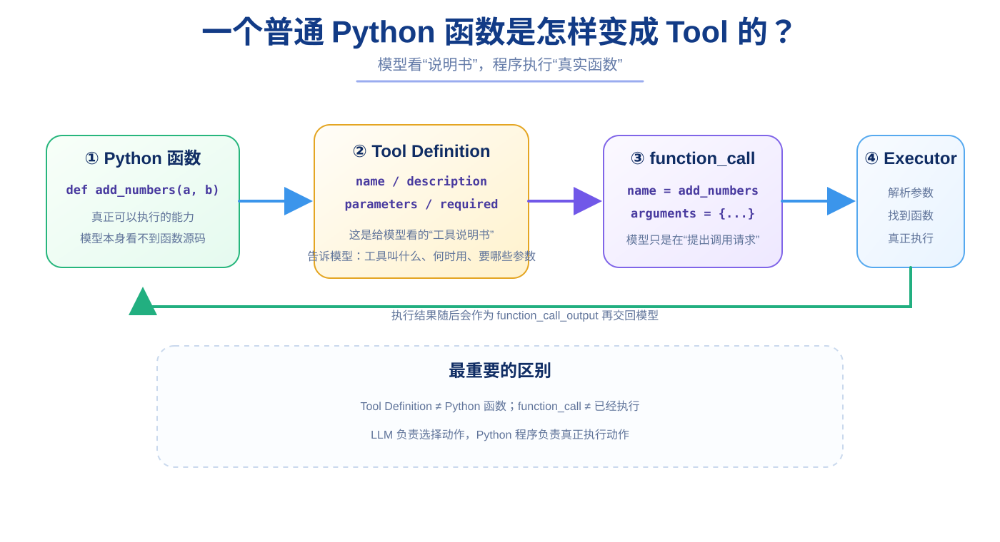

# 第 15 章：Tool Calling —— Chatbot 与 Agent 的分界线

> **本章目标**：理解“模型会调用工具”到底是什么意思，并让模型第一次返回 `function_call`。  
> **完成效果**：你能清楚区分 Python 函数、Tool Definition、`function_call` 三个完全不同的东西。  
> **核心知识**：Function Tool、JSON Schema、模型决策、程序执行。



到第 14 章为止，我们的程序已经能够：

```text
用户输入
↓
FastAPI
↓
Responses API
↓
模型生成文字
↓
返回用户
```

但它仍然更像一个聊天机器人。

为什么？

因为模型现在只能：

```text
“想”
+
“说”
```

它还不能真正去：

```text
查服务器时间
执行 Python
调用数据库
请求其他 API
读取文件
```

所以这一章开始给模型“行动能力”。

---

## 15.1 先从一个普通 Python 函数开始

打开：

```text
app/tools.py
```

先写最简单的函数：

```python
def add_numbers(a: float, b: float):
    return a + b
```

先单独测试：

```bash
python -c "from app.tools import add_numbers; print(add_numbers(123, 456))"
```

应该输出：

```text
579
```

这一步完全没有 AI。

它只是一个普通 Python 函数。

这一点非常重要，因为很多初学者会把“Tool”想成一种神秘的新对象。

实际上最底层通常仍然只是：

```text
普通 Python 函数
```

---

## 15.2 既然函数已经存在，为什么模型不能直接调用？

因为大模型并不会自动扫描你的 Python 项目。

它并不知道：

```python
def add_numbers(...)
```

存在。

模型看到的不是你的整个源码目录。

所以我们需要主动告诉模型：

> “我这里有一个叫 `add_numbers` 的工具，它可以计算两个数字的加法，需要两个参数 `a` 和 `b`。”

这就是 **Tool Definition**。

---

## 15.3 Tool Definition 是“说明书”，不是函数本身

在 `app/tools.py` 中增加：

```python
TOOL_DEFINITIONS = [
    {
        "type": "function",
        "name": "add_numbers",
        "description": "计算两个数字的加法",
        "parameters": {
            "type": "object",
            "properties": {
                "a": {
                    "type": "number",
                    "description": "第一个数字",
                },
                "b": {
                    "type": "number",
                    "description": "第二个数字",
                },
            },
            "required": ["a", "b"],
            "additionalProperties": False,
        },
        "strict": True,
    }
]
```

现在一定要分清：

```text
add_numbers()
→ Python 真正能执行的函数

TOOL_DEFINITIONS
→ 给模型看的工具说明书
```

它们不是同一个东西。

---

## 15.4 Tool Definition 每个字段是什么意思？

### `type`

```python
"type": "function"
```

告诉模型：

> 这是一个函数类型的工具。

### `name`

```python
"name": "add_numbers"
```

这是模型以后发起调用时使用的工具名。

最好和 Python Registry 中的名字保持一致。

### `description`

```python
"description": "计算两个数字的加法"
```

这是模型判断“什么时候该用这个工具”的重要依据。

如果 description 写得很模糊，模型也更容易选错工具。

### `parameters`

这是一份 JSON Schema，用来描述工具参数。

```python
"parameters": {
    "type": "object",
    ...
}
```

意思是：

> 参数整体应该是一个 JSON object。

### `properties`

```python
"properties": {
    "a": {"type": "number"},
    "b": {"type": "number"},
}
```

说明这个 object 中有哪些字段。

### `required`

```python
"required": ["a", "b"]
```

表示：

> `a` 和 `b` 都必须提供。

### `additionalProperties: False`

表示不希望模型额外生成未定义字段。

### `strict: True`

表示希望模型尽量严格遵守这份参数 Schema。

---

## 15.5 一个非常经典的错误：`properties` 拼错

例如误写成：

```python
"proerties": {
    "code": {...}
}
```

少了一个 `p`。

对 Python 来说，它只是一个普通字典 key，不一定立刻语法报错。

但对模型的 Tool Schema 来说：

```text
properties
```

才是有意义的标准字段。

结果模型可能根本不知道 `code` 参数存在，最后返回：

```text
arguments = {}
```

所以 Tool Calling 调试时，Schema 拼写非常重要。

---

## 15.6 把工具说明传给 Responses API

我们的 `app/llm.py` 支持：

```python
async def create_model_response(
    input_data,
    *,
    instructions=...,
    previous_response_id=None,
    tools=None,
):
    ...
```

当需要 Tool Calling 时：

```python
response = await create_model_response(
    "请使用工具计算 123 加 456",
    tools=TOOL_DEFINITIONS,
)
```

这一步只是告诉模型：

> 你现在除了生成文字，还可以从这些工具中选择动作。

注意：

```text
传 tools
≠
程序已经执行工具
```

---

## 15.7 模型返回 `function_call` 时到底发生了什么？

Responses API 的：

```python
response.output
```

可能包含不同 item。

我们可以检查：

```python
for item in response.output:
    print(item.type)
```

如果模型决定使用工具，可能出现：

```text
function_call
```

这个 item 中会有类似：

```text
name
arguments
call_id
```

例如概念上：

```text
name = add_numbers
arguments = {"a":123,"b":456}
call_id = call_xxx
```

注意模型做的只是：

> “我认为应该调用 `add_numbers`，参数应该是这些。”

模型**并没有真正运行 Python 函数**。

---

## 15.8 为什么 Tool Calling 是 Chatbot → Agent 的关键变化？

普通聊天：

```text
用户
↓
模型
↓
文字
```

有 Tool Calling 后：

```text
用户
↓
模型
↓
模型选择动作
↓
你的程序执行动作
↓
真实世界结果
```

模型开始从：

```text
只会生成语言
```

变成：

```text
可以通过程序间接影响外部系统
```

这就是 Agent 能力的重要基础。

---

## 15.9 这一章暂时不要做什么？

这一章先不要急着写复杂 Agent Loop。

只确认三件事：

```text
1. Python 函数能单独运行
2. 模型看得到 Tool Definition
3. 模型能够返回 function_call
```

下一章再解决：

> 模型说“调用 add_numbers”以后，我们的程序到底怎样找到并执行它？

---

### 第 15 章检查清单

```text
[ ] 能单独运行 add_numbers()
[ ] 能解释 Tool Definition 不是 Python 函数
[ ] 知道 description 会影响模型选工具
[ ] 知道 parameters 是 JSON Schema
[ ] 知道 required 的作用
[ ] 知道 response.output 可能包含 function_call
[ ] 知道 LLM 返回 function_call 时工具还没有真正执行
```

### 本章小练习

新增一个普通函数：

```python
def multiply(a: float, b: float):
    return a * b
```

然后自己写对应 Tool Definition。

先不要加入 Registry。

### 你现在应该能回答

> `function_call` 是“模型执行了函数”还是“模型提出了函数调用请求”？

正确答案是后者。
