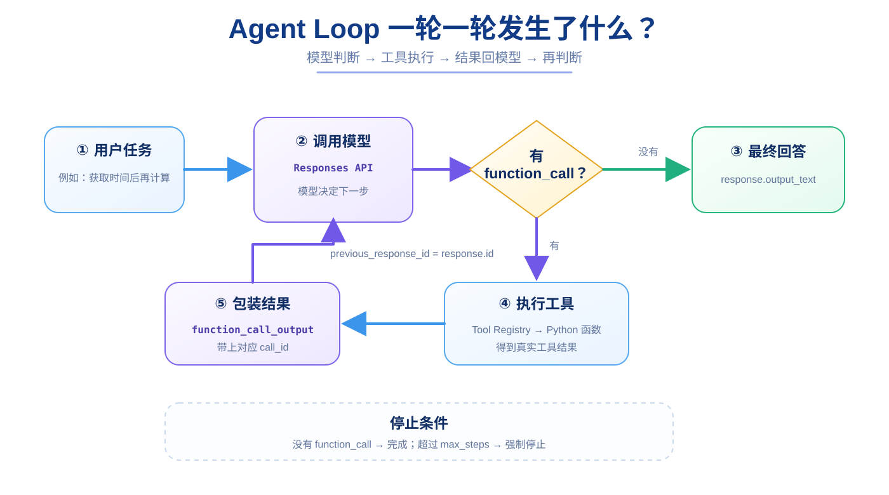

# 第 18 章：Agent Loop —— 整个 Agent 的心脏

> **本章目标**：让模型可以连续执行“思考 → 调工具 → 看结果 → 再决定下一步”，直到任务完成。  
> **完成效果**：Agent 不再只允许一轮工具调用，而是可以多轮使用不同工具。  
> **核心知识**：循环、状态推进、工具结果、停止条件、最大步数、Agent Runtime。



前面三章已经分别解决：

```text
第 15 章
模型会提出 function_call

第 16 章
Python 能根据工具名找到并执行函数

第 17 章
工具结果能通过 function_call_output 回到模型
```

现在只差最后一件事：

> 如果模型看完工具结果以后，还想继续调用另一个工具怎么办？

这就是 **Agent Loop**。

---

## 18.1 为什么“一轮 Tool Calling”还不够？

假设用户说：

```text
先获取服务器当前时间，
然后把当前秒数加 100，
加法也必须使用工具。
```

第一轮模型还不知道当前时间。

所以可能先：

```text
function_call
→ get_server_time
```

工具返回：

```text
2026-09-11 10:52:33
```

现在模型才知道：

```text
秒数 = 33
```

下一步它还需要：

```text
function_call
→ add_numbers(a=33, b=100)
```

得到：

```text
133
```

然后模型才能生成最终回答。

也就是说一个真实任务可能是：

```text
模型
↓
工具 A
↓
模型
↓
工具 B
↓
模型
↓
最终答案
```

如果程序写死成：

```text
模型
↓
只允许一轮工具
↓
模型
↓
必须结束
```

就不是真正通用的 Agent Loop。

---

## 18.2 Agent Loop 的最小伪代码

先不要看最终代码。

它本质可以浓缩成：

```python
response = await call_model(...)

for step in range(max_steps):
    if 模型没有请求工具:
        return 最终答案

    执行模型请求的工具
    把工具结果交回模型
    response = await call_model(...)

return "超过最大步骤，停止"
```

这已经是一个最小 Agent Runtime 的核心。

---

## 18.3 为什么第一轮模型调用放在循环外？

最终项目：

```python
response = await create_model_response(
    user_input,
    instructions=AGENT_INSTRUCTIONS,
    previous_response_id=previous_response_id,
    tools=TOOL_DEFINITIONS,
)

for step in range(max_steps):
    ...
```

第一轮要先把用户任务交给模型。

只有拿到第一份：

```python
response
```

我们才知道模型：

```text
直接回答？
还是请求工具？
```

循环处理的其实是：

> 当前这份 Response 之后应该做什么。

---

## 18.4 每一轮先检查 `function_call`

```python
tool_calls = [
    item
    for item in response.output
    if item.type == "function_call"
]
```

然后：

```python
if not tool_calls:
    ...
```

意思：

> 当前 Response 已经没有工具请求了。

这时候我们认为模型准备给最终答案。

于是：

```python
reply = response.output_text
```

然后结束：

```python
return reply
```

所以 Agent Loop 最自然的停止条件之一就是：

```text
没有 function_call
```

---

## 18.5 如果有 Tool Call，就执行这一轮所有工具

```python
tool_outputs = []

for tool_call in tool_calls:
    tool_result = await execute_tool(
        tool_call
    )

    tool_outputs.append({
        "type": "function_call_output",
        "call_id": tool_call.call_id,
        "output": str(tool_result),
    })
```

这一段做的事情：

```text
模型提出一组调用
↓
逐个执行
↓
每个结果包装成 function_call_output
↓
收集到 tool_outputs
```

最后 `tool_outputs` 可能类似：

```python
[
    {
        "type": "function_call_output",
        "call_id": "call_1",
        "output": "2026-09-11 10:52:33",
    },
    {
        "type": "function_call_output",
        "call_id": "call_2",
        "output": "187",
    },
]
```

---

## 18.6 把结果交回模型以后，为什么不是直接 `return`？

```python
response = await create_model_response(
    tool_outputs,
    instructions=AGENT_INSTRUCTIONS,
    previous_response_id=response.id,
    tools=TOOL_DEFINITIONS,
)
```

这一次模型看到的是：

```text
上一轮自己提出的 function_call
+
程序真实执行得到的 function_call_output
```

然后它可能做两种选择。

### 选择 A：任务完成

返回普通文本。

下一轮循环检查：

```python
not tool_calls
```

成立，于是结束。

### 选择 B：还需要别的工具

再产生：

```text
function_call
```

循环继续。

所以关键不是：

```text
工具执行完 → return
```

而是：

```text
工具执行完
↓
模型再次判断
↓
再决定是否结束
```

这就是 Agent Loop 的核心。

---

## 18.7 `previous_response_id=response.id` 在循环里为什么重要？

当前模型 Response：

```text
Response A
```

里面包含它提出的工具调用。

我们下一次发送工具结果时：

```python
previous_response_id=response.id
```

就是告诉 Responses API：

> 这些 `function_call_output` 是在继续刚才那一轮。

然后新的模型结果成为：

```text
Response B
```

如果 Response B 又调用工具，下一轮再：

```text
previous_response_id = Response B.id
```

所以循环实际上也在不断推进 Response 链：

```text
Response A
↓
Response B
↓
Response C
↓
...
```

---

## 18.8 为什么一定要有 `max_steps`？

最危险的初学写法之一：

```python
while True:
    ...
```

模型如果不断产生错误调用：

```text
工具调用
↓
错误
↓
重新调用
↓
还是错误
↓
继续调用
```

程序可能长时间不结束。

而模型请求和外部工具可能都涉及成本。

所以最终项目：

```python
max_steps: int = 10
```

然后：

```python
for step in range(max_steps):
```

最多执行有限轮数。

如果还没结束：

```python
return "任务执行步骤过多，已停止。"
```

---

## 18.9 真实 Agent 还有哪些停止条件？

大型项目不只限制：

```text
最大步骤数
```

还可能限制：

```text
最大总执行时间
最大 Token
最大模型调用次数
最大工具调用次数
最大金额 / 成本
用户取消
工具权限失败
```

所以“停止条件”本身也是 Agent Runtime 的重要组成部分。

---

## 18.10 为什么记录 `Agent step` 日志？

```python
logger.info(
    "Agent step=%s",
    step + 1,
)
```

这是非常有价值的调试信息。

例如：

```text
Agent step=1
执行 get_server_time

Agent step=2
执行 add_numbers

Agent step=3
最终回答
```

你可以一眼看到 Agent 到底走了几轮。

如果日志变成：

```text
Agent step=1
Agent step=2
Agent step=3
...
Agent step=10
```

还没有结束，就说明需要检查：

```text
模型是否一直重复调用工具？
工具是否一直返回错误？
System Instructions 是否不清楚？
Tool Schema 是否有问题？
```

---

## 18.11 Agent Instructions 为什么开始变重要？

最终项目里：

```python
AGENT_INSTRUCTIONS = (
    "你是一个AI Agent。"
    "需要工具时必须使用提供的工具，不要编造工具执行结果。"
    "调用工具时必须提供工具定义中的必需参数。"
    "如果工具返回错误，请根据错误信息修正并继续。"
    "数学计算、数据处理或算法任务可以使用run_python。"
)
```

它不负责真正执行工具。

但它帮助模型理解：

```text
什么情况下应该用工具
工具失败以后该怎么办
哪些结果不能自己编
```

可以把：

```text
Tool Definition
```

理解成“每个工具自己的说明书”；

把：

```text
AGENT_INSTRUCTIONS
```

理解成“整个 Agent 的工作规则”。

---

## 18.12 完整 `run_agent()` 逐段看

最终项目：

```python
async def run_agent(
    session_id: str,
    user_input: str,
    max_steps: int = 10,
):
    previous_response_id = get_previous_response_id(
        session_id
    )

    response = await create_model_response(
        user_input,
        instructions=AGENT_INSTRUCTIONS,
        previous_response_id=previous_response_id,
        tools=TOOL_DEFINITIONS,
    )

    for step in range(max_steps):
        logger.info("Agent step=%s", step + 1)

        tool_calls = [
            item
            for item in response.output
            if item.type == "function_call"
        ]

        if not tool_calls:
            reply = response.output_text

            save_message(
                session_id,
                "user",
                user_input,
            )
            save_message(
                session_id,
                "assistant",
                reply,
            )
            set_previous_response_id(
                session_id,
                response.id,
            )

            return reply

        tool_outputs = []

        for tool_call in tool_calls:
            tool_result = await execute_tool(
                tool_call
            )

            tool_outputs.append({
                "type": "function_call_output",
                "call_id": tool_call.call_id,
                "output": str(tool_result),
            })

        response = await create_model_response(
            tool_outputs,
            instructions=AGENT_INSTRUCTIONS,
            previous_response_id=response.id,
            tools=TOOL_DEFINITIONS,
        )

    set_previous_response_id(
        session_id,
        response.id,
    )

    return "任务执行步骤过多，已停止。"
```

不要试图一次背下来。

只按四块记：

```text
A. 取 Session 状态 + 第一次问模型

B. 检查有没有 function_call

C. 执行工具 + 包装 function_call_output

D. 结果回模型 + 进入下一轮
```

---

## 18.13 现在测试一个真正需要多轮的任务

可以直接调用 `/agent`，也可以在 Python 中测试 `run_agent()`。

例如：

```text
请先使用工具获取服务器当前时间，
然后取当前秒数加100，
加法也必须使用工具。
```

理想日志类似：

```text
Agent step=1
执行工具 name=get_server_time arguments={}
工具执行完成 ...

Agent step=2
执行工具 name=add_numbers arguments={'a':33,'b':100}
工具执行完成 ... result=133

Agent step=3
```

第 3 轮通常没有新的 tool call，于是返回最终回答。

注意：不同模型的规划方式可能不同。

它也可能一轮提出多个工具，或者生成不同但合理的步骤。

我们判断程序是否正确，不应该要求模型每次路径一模一样。

---

## 18.14 一个重要现实：Agent 不是“绝对确定的程序”

传统代码：

```python
if x:
    do_a()
else:
    do_b()
```

通常路径非常确定。

Agent 中：

```text
下一步选择
```

部分由模型生成。

所以同一个任务可能出现：

```text
不同工具顺序
不同参数表达
不同步骤数量
```

这也是为什么 Agent 工程特别需要：

```text
日志
Tracing
最大步骤
参数校验
工具权限
测试
```

---

## 18.15 到这里，“Agent”可以怎么定义？

对本教程这个最小系统来说：

```text
Agent
=
LLM
+
Tools
+
Tool Executor
+
Agent Loop
+
State
```

下一章再加入：

```text
Sandbox
```

给通用代码执行增加安全边界。

所以 Agent 不是单独某一行：

```python
agent = ...
```

而是一套协作机制。

---

### 第 18 章检查清单

```text
[ ] 能解释为什么一轮 Tool Calling 不够
[ ] 知道循环每轮先检查 function_call
[ ] 没有 function_call 时返回 output_text
[ ] 有 function_call 时执行工具并构造 outputs
[ ] 知道工具结果回模型后可能再次产生 function_call
[ ] 能解释 previous_response_id 在 Loop 中怎样推进状态
[ ] 知道 max_steps 为什么必须存在
[ ] 能通过 Agent step 日志观察循环
[ ] 知道模型行为不是完全确定的
```

### 本章小练习 1：降低最大步数

临时：

```python
max_steps = 2
```

给 Agent 一个可能需要多轮工具的任务。

观察超过限制以后发生什么。

完成后恢复：

```python
max_steps = 10
```

### 本章小练习 2：不用看代码画 Loop

拿一张纸，自己画：

```text
用户
↓
模型
↓
需要工具？
↓
执行
↓
结果
↓
模型
```

如果你能画出来并解释每个箭头，这一章比“把代码背下来”更有价值。

### 你现在应该能回答

> Agent Loop 的真正停止条件是什么？为什么不能只写 `while True`？
