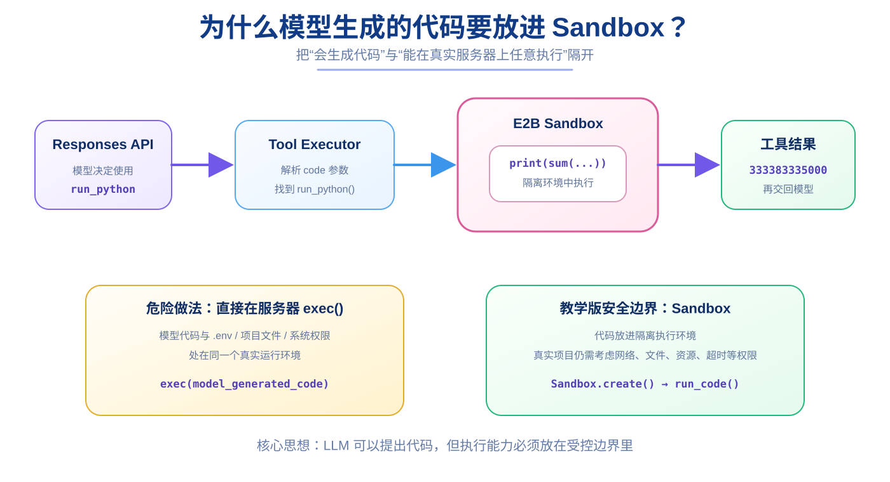

# 第 19 章：E2B Sandbox —— 为什么模型生成的代码不能直接在你的服务器上跑

> **本章目标**：理解为什么 Agent 需要代码执行能力，以及为什么这项能力必须放进隔离环境。  
> **完成效果**：你可以把模型生成的 Python 交给 `run_python(code)`，并让它在 E2B Sandbox 中执行。  
> **核心知识**：Sandbox、安全边界、远程执行、stdout、表达式结果、同步工具与异步 Agent 的衔接。



前面我们的工具都比较“窄”：

```text
get_server_time()
add_numbers(a, b)
```

这些能力是我们提前写死的。

但很多 Agent 任务并不是提前知道所有函数就能解决。

例如用户说：

```text
请用 Python 计算前 30 个斐波那契数，并告诉我第 30 个是多少。
```

你当然可以专门再写一个：

```python
def fibonacci(...):
    ...
```

但如果下一个用户又问：

```text
统计一组数据的均值
画一张图
解析一个 CSV
跑一个算法
```

你不可能提前为每一种问题都写一个独立工具。

于是一个非常通用的能力出现了：

```text
run_python(code)
```

模型负责生成代码，工具负责执行代码。

---

## 19.1 为什么 `run_python` 很强？

假设模型生成：

```python
numbers = [12, 18, 23, 42, 7]
print(sum(numbers) / len(numbers))
```

如果 Agent 有一个：

```python
run_python(code)
```

它就不需要我们提前写：

```text
calculate_average
calculate_variance
fibonacci
sort_numbers
...
```

模型可以根据问题自己生成一次性的 Python 程序。

所以代码执行工具让 Agent 的能力从：

```text
只能调用预定义动作
```

变成：

```text
可以动态组合出新的计算过程
```

这也是很多通用 Agent 很重要的能力。

---

## 19.2 但为什么不能直接 `exec()`？

Python 本身有：

```python
exec(code)
```

如果我们这样写：

```python
def run_python(code: str):
    exec(code)
```

看起来非常简单。

但这意味着：

> **模型生成的代码会直接运行在你真实的 WSL / 服务器 Python 进程里。**

它理论上可以尝试：

```text
读取项目文件
读取 .env
删除文件
安装软件
访问网络
访问系统目录
无限循环
占满 CPU / 内存
```

即使模型没有恶意，也可能因为生成错误代码破坏环境。

所以我们需要一个非常重要的边界：

```text
模型生成代码
↓
隔离环境
↓
执行
↓
只把结果拿回来
```

这就是 Sandbox 的价值。

---

## 19.3 Sandbox 不是“绝对安全”四个字

需要非常明确一点：

> Sandbox 的目标是降低执行不受信代码的风险，而不是一句“用了 Sandbox 就百分之百安全”。

真实生产系统还会继续考虑：

```text
网络是否允许访问
文件系统挂载范围
CPU / 内存限制
执行超时
并发限制
安装第三方包的权限
敏感环境变量是否传入
审计日志
```

本教程先只建立第一层概念：

```text
不要让模型代码直接和真实应用服务器共享执行环境
```

---

## 19.4 安装 E2B Code Interpreter SDK

确保虚拟环境已激活：

```text
(.venv)
```

安装：

```bash
pip install e2b-code-interpreter
```

确认：

```bash
pip show e2b-code-interpreter
```

然后在 `.env` 中配置：

```env
E2B_API_KEY=你的真实E2BKey
```

不要提交真实 `.env`。

---

## 19.5 先不要接 Agent，单独测试 Sandbox

这一章仍然坚持“逐层验证”。

先只验证：

```text
你的 Python
↓
E2B
↓
远端 Sandbox
↓
执行 Python
↓
结果回来
```

执行：

```bash
python -c "from dotenv import load_dotenv; load_dotenv(); from e2b_code_interpreter import Sandbox; s=Sandbox.create(); r=s.run_code('print(123 + 456)'); print(r.logs.stdout); s.kill()"
```

正常应该看到类似：

```text
['579']
```

这说明 E2B 这条链已经通了。

---

## 19.6 为什么是 `Sandbox.create()`，不是 `Sandbox()`？

当前 SDK 中，我们使用：

```python
Sandbox.create()
```

因为创建 Sandbox 不只是创建一个普通 Python 本地对象。

背后还要：

```text
向 E2B 服务请求一个沙箱
↓
获得 sandbox id / 连接信息
↓
建立远程连接
↓
返回可操作的 Sandbox 对象
```

如果你直接调用底层构造器，可能看到类似：

```text
missing required positional arguments:
sandbox_id
connection_config
...
```

这类错误不是你的业务代码逻辑错，而是说明：

> 你绕过了 SDK 提供的创建流程。

---

## 19.7 `execution.text` 为什么有时是 `None`？

这是非常容易困惑的一点。

如果执行：

```python
print(123 + 456)
```

`print()` 输出属于：

```text
stdout
```

因此更适合看：

```python
execution.logs.stdout
```

而如果执行的是表达式：

```python
123 + 456
```

某些 Code Interpreter 结果会把表达式结果放到：

```python
execution.text
```

所以：

```text
print(...)
→ 优先看 logs.stdout

最后一个表达式
→ 可能看 execution.text
```

这就是为什么我们的工具同时处理两种结果。

---

## 19.8 创建 `app/sandbox.py`

创建：

```bash
touch app/sandbox.py
```

写：

```python
from e2b_code_interpreter import Sandbox


def run_python(code: str):
    with Sandbox.create() as sandbox:
        execution = sandbox.run_code(code)

        if execution.error:
            return f"Python执行失败：{execution.error}"

        if execution.logs.stdout:
            return "\n".join(execution.logs.stdout)

        if execution.text:
            return execution.text

        return "代码执行成功，但没有输出。"
```

这就是项目里的代码执行边界。

---

## 19.9 为什么使用 `with Sandbox.create() as sandbox`？

`with` 可以先理解成：

```text
进入资源作用域
↓
使用 Sandbox
↓
离开作用域时做清理
```

它让“创建”和“释放资源”的生命周期更清楚。

如果你不用 `with`，也可以手动：

```python
sandbox = Sandbox.create()
...
sandbox.kill()
```

但需要自己确保异常情况下也能正确清理。

---

## 19.10 先独立测试 `run_python()`

执行：

```bash
python -c "from dotenv import load_dotenv; load_dotenv(); from app.sandbox import run_python; print(run_python('print(sum(i**2 for i in range(1, 11)))'))"
```

应该得到：

```text
385
```

这说明：

```text
run_python()
↓
Sandbox.create()
↓
run_code()
↓
stdout
↓
返回字符串
```

已经独立工作。

---

## 19.11 把 `run_python` 注册成 Tool

打开：

```text
app/tools.py
```

导入：

```python
from app.sandbox import run_python
```

Registry：

```python
TOOL_REGISTRY = {
    "get_server_time": get_server_time,
    "add_numbers": add_numbers,
    "run_python": run_python,
}
```

再给模型 Tool Definition：

```python
{
    "type": "function",
    "name": "run_python",
    "description": (
        "在隔离的E2B沙箱中执行Python代码。"
        "适合精确计算、数据处理和算法任务。"
        "调用时必须通过code参数提供完整可执行Python代码。"
    ),
    "parameters": {
        "type": "object",
        "properties": {
            "code": {
                "type": "string",
                "description": "需要执行的完整Python代码"
            }
        },
        "required": ["code"],
        "additionalProperties": False
    },
    "strict": True
}
```

现在：

```text
LLM 知道有 run_python
```

和：

```text
Python 真正知道 run_python 指向哪个函数
```

两边就接起来了。

---

## 19.12 一个真实踩坑：`arguments={}`

如果日志出现：

```text
执行工具 name=run_python arguments={}
```

随后：

```text
TypeError: run_python() missing 1 required positional argument: 'code'
```

先检查 Tool Schema。

最常见错误之一是：

```text
properties
```

拼成：

```text
proerties
```

或者把：

```python
"required": ["code"]
```

放到了错误层级。

正确结构一定是：

```text
parameters
├── type
├── properties
│   └── code
├── required
└── additionalProperties
```

这类错误很有代表性：

> Tool Definition 是模型理解工具参数的契约，Schema 写错，模型就可能根本不知道应该传什么。

---

## 19.13 为什么 Tool Executor 还要检查缺失参数？

即使 Schema 已经定义：

```python
"required": ["code"]
```

我们的 Executor 仍然会通过：

```python
inspect.signature(tool_function)
```

检查真实 Python 函数需要哪些参数。

原因是：

```text
模型可能犯错
第三方兼容 API 可能不完全遵循 strict schema
工具定义和 Python 函数未来可能发生不一致
```

所以 Executor 再做一层保护。

这是一种“不要把正确性完全寄托在模型输出上”的工程思维。

---

## 19.14 为什么 `run_python()` 放进 `asyncio.to_thread()`？

我们的 Agent Loop 是异步的。

但是：

```python
run_python(code)
```

本身是一个同步函数，而且里面还会等待 E2B 网络操作。

如果直接在异步事件循环中执行，可能阻塞 Event Loop。

所以 Executor 使用：

```python
result = await asyncio.to_thread(
    tool_function,
    **tool_arguments,
)
```

可以先理解成：

> 把这个同步工具放到工作线程执行，不要让它长期卡住当前异步事件循环。

这不是让 E2B“计算更快”。

它解决的是：

```text
异步 Web 服务
和
同步工具函数
```

之间的协作问题。

---

## 19.15 第一次让 Agent 自己写 Python

现在测试一个你没有提前写专用函数的问题：

```text
请使用 Python 工具计算 1 到 10000 所有整数的平方和
```

模型可能生成：

```python
print(sum(i ** 2 for i in range(1, 10001)))
```

然后：

```text
function_call run_python
↓
Tool Registry
↓
run_python(code)
↓
E2B Sandbox
↓
333383335000
↓
function_call_output
↓
模型最终回答
```

理想日志：

```text
Agent step=1
执行工具 name=run_python arguments={'code': '...'}
工具执行完成 name=run_python result=333383335000
Agent step=2
```

这时候真正发生了一次：

> **自然语言 → 模型生成程序 → 隔离执行 → 真实结果 → 模型组织答案。**

---

## 19.16 一个值得保留的限制意识

当前教学版 `run_python` 很简单。

生产系统还会继续处理：

```text
执行超时
输出长度限制
文件上传下载
依赖安装策略
网络访问控制
并发 Sandbox 数量
成本
重试
错误类型结构化
```

所以本章学完得到的是：

> **Sandbox 的基本设计思想和最小可运行实现。**

而不是“已经做完生产级安全执行平台”。

---

### 第 19 章检查清单

```text
[ ] 能解释为什么不直接 exec(model_generated_code)
[ ] E2B SDK 已安装
[ ] E2B_API_KEY 已配置且未提交 GitHub
[ ] Sandbox.create() 能创建沙箱
[ ] 能解释 logs.stdout 和 execution.text 的区别
[ ] app/sandbox.py 中有 run_python()
[ ] run_python 已加入 TOOL_REGISTRY
[ ] Tool Definition 中 code 是 required
[ ] Agent 能真的调用 run_python
[ ] 知道 Sandbox 不是“绝对安全”的一句口号
```

### 本章小练习

分别让 Agent 使用 `run_python`：

```text
1. 计算前 30 个斐波那契数
2. 计算 [10, 20, 30, 40] 的平均值
3. 对 [5, 1, 9, 3] 排序
```

观察模型为不同任务生成了什么 Python。

### 你现在应该能回答

> 为什么 `run_python` 比 `add_numbers` 更通用，但同时也更需要安全边界？

---

下一章：[第 20 章：最小网页与完整端到端串联](20-frontend-e2e.md)
