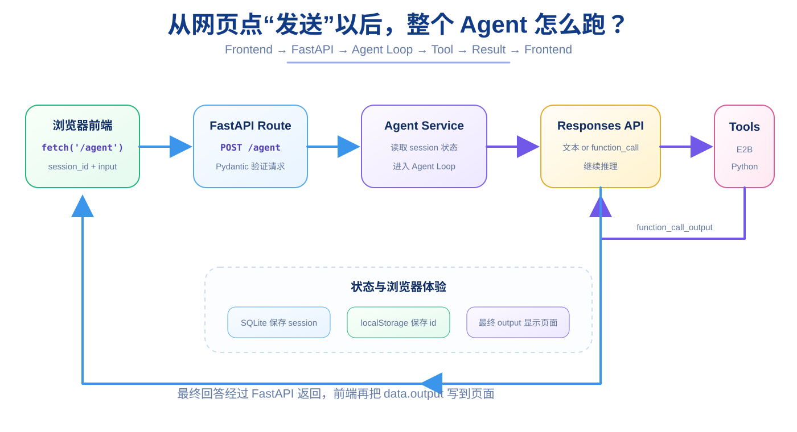

# 第 20 章：最小网页与完整端到端串联 —— 把 Agent 变成一个真的能用的小产品

> **本章目标**：把前 19 章的后端、Session、Agent Loop、Tools、E2B 串进一个最小网页。  
> **完成效果**：浏览器输入任务，后端经过 `/agent` 调用模型和工具，最终把回答显示回页面；还可以点击“新会话”清掉旧上下文。  
> **核心知识**：HTML、JavaScript、`fetch()`、JSON、CORS、`localStorage`、Session、前后端端口、端到端调用链。



前面 19 章里，我们已经分别验证了很多局部能力：

```text
Python 能运行
FastAPI 能接请求
Responses API 能返回模型结果
SQLite 能保存 Session
Tool Calling 能产生 function_call
Tool Executor 能执行真实 Python 函数
Agent Loop 能连续多步
E2B 能隔离执行模型代码
```

最后一章要做的事情不是再引入一个新的“神奇 Agent 概念”。

而是把这些东西真正串起来：

```text
浏览器
↓
FastAPI
↓
Agent Service
↓
Responses API
↓
Tool / E2B
↓
最终回答
↓
浏览器
```

当这条链真的跑通时，你写的就不再只是几个测试脚本，而是一个最小可交互 Agent 应用。

---

## 20.1 为什么第一版前端不用 React / Next.js？

你当然可以用：

```text
React
Next.js
Vue
TypeScript
Vite
```

但这个教程的主角是 Agent。

如果最后一章突然同时引入：

```text
Node.js
npm
组件
状态管理
构建工具
前端路由
```

初学者很容易分不清自己到底卡在 Agent 还是前端框架。

所以第一版故意只使用：

```text
HTML
CSS
JavaScript
```

一个文件：

```text
frontend/index.html
```

先把 HTTP 调用链看懂。

---

## 20.2 创建前端目录

项目根目录执行：

```bash
mkdir -p frontend
touch frontend/index.html
```

现在项目大概是：

```text
mini--mm-agent/
├── app/
├── frontend/
│   └── index.html
├── .env
├── chat.db
└── ...
```

---

## 20.3 先写最小 HTML 骨架

`frontend/index.html`：

```html
<!DOCTYPE html>
<html lang="zh-CN">
<head>
    <meta charset="UTF-8">
    <title>Mini Agent</title>
</head>
<body>
    <h1>Mini Agent</h1>

    <div id="messages"></div>

    <input
        id="message-input"
        placeholder="输入任务..."
    >

    <button id="send-button">
        发送
    </button>

    <button id="new-session-button">
        新会话
    </button>
</body>
</html>
```

这一阶段没有 Agent，也没有网络请求。

先只验证：

> 浏览器能不能打开我们的 HTML？

---

## 20.4 为什么不直接双击 `index.html`？

直接打开本地文件可能得到：

```text
file:///...
```

但我们最终希望模拟真正的 Web 环境。

所以在项目根目录新开一个 Terminal：

```bash
python3 -m http.server 3000 --directory frontend
```

它会启动一个非常简单的静态文件服务器。

浏览器打开：

```text
http://127.0.0.1:3000
```

如果看到：

```text
Mini Agent
输入框
发送
新会话
```

说明前端静态服务正常。

### 如果打开 `/` 是 404

先检查：

```bash
pwd
ls -la frontend
```

确认：

```text
frontend/index.html
```

真的存在并且已经保存。

`python3 -m http.server 3000 --directory frontend` 会把 `frontend/` 当作网站根目录。

所以浏览器访问 `/` 时，它会寻找：

```text
frontend/index.html
```

---

## 20.5 用 JavaScript 获取页面元素

在 `</body>` 前增加：

```html
<script>
    const input = document.getElementById("message-input");
    const sendButton = document.getElementById("send-button");
    const newSessionButton = document.getElementById("new-session-button");
    const messages = document.getElementById("messages");
</script>
```

这里：

```javascript
document.getElementById(...)
```

是在告诉浏览器：

> 找到页面里这个 id 对应的 HTML 元素，让 JavaScript 可以操作它。

例如：

```javascript
input.value
```

就能读取输入框当前文字。

---

## 20.6 为什么前端需要 `session_id`？

后端已经依赖：

```text
session_id → previous_response_id
```

来区分不同会话。

所以浏览器每次发请求时都必须带一个稳定的 `session_id`。

我们让浏览器第一次打开时生成：

```javascript
crypto.randomUUID()
```

然后存到：

```javascript
localStorage
```

写：

```javascript
let sessionId =
    localStorage.getItem("mini-agent-session")
    || crypto.randomUUID();

localStorage.setItem(
    "mini-agent-session",
    sessionId
);
```

为什么使用 `let`，而不是 `const`？

因为后面点击“新会话”时，我们会生成一个新的 session id。

---

## 20.7 `localStorage` 是什么？

可以先理解成：

> 浏览器为这个网站保存的一小块本地键值数据。

我们保存：

```text
mini-agent-session
→ 550e8400-e29b-...
```

这样：

```text
页面刷新
↓
JavaScript 再次读取 localStorage
↓
仍然使用原 session id
```

于是刷新页面不会自动变成完全新的后端 Session。

注意：

> `localStorage` 不是数据库，也不是登录系统。

它只是教学版里一个非常轻量的浏览器侧状态保存方式。

---

## 20.8 写一个 `addMessage()`，把文字显示到页面

```javascript
function addMessage(role, text) {
    const div = document.createElement("div");

    if (role === "user") {
        div.textContent = "你：" + text;
    } else {
        div.textContent = "Agent：" + text;
    }

    messages.appendChild(div);
}
```

这段代码完全没有 AI。

它只是：

```text
创建 div
↓
放文字进去
↓
追加到 messages 区域
```

把“网络逻辑”和“页面显示逻辑”先区分开。

---

## 20.9 `fetch()` 就是浏览器里的 HTTP 客户端

现在最核心的部分来了。

```javascript
const response = await fetch(
    "http://127.0.0.1:8001/agent",
    {
        method: "POST",
        headers: {
            "Content-Type": "application/json"
        },
        body: JSON.stringify({
            session_id: sessionId,
            input: message
        })
    }
);
```

如果你认真学过第 5 章，这段代码不应该再是陌生语法堆。

它和 curl 是一一对应的：

```text
fetch URL
↔ curl URL

method: "POST"
↔ -X POST

headers
↔ -H

body
↔ -d
```

所以：

> **前端调用后端，并没有换一种完全不同的世界。本质还是 HTTP。**

---

## 20.10 为什么要 `JSON.stringify()`？

JavaScript 中：

```javascript
{
    session_id: sessionId,
    input: message
}
```

是一个 JavaScript 对象。

HTTP Body 最后需要传输文本 / 字节。

所以：

```javascript
JSON.stringify(...)
```

把对象序列化成 JSON 字符串。

这和 Python 中：

```python
json.dumps(...)
```

角色很像。

---

## 20.11 为什么请求后还要 `response.json()`？

后端 `/agent` 返回：

```json
{
  "output": "最终回答"
}
```

前端收到 HTTP Response 后：

```javascript
const data = await response.json();
```

把 JSON 响应解析成 JavaScript 对象。

之后：

```javascript
data.output
```

就是 Agent 最终回答。

---

## 20.12 完整 `sendMessage()`

```javascript
async function sendMessage() {
    const message = input.value.trim();

    if (!message) {
        return;
    }

    addMessage("user", message);
    input.value = "";

    sendButton.disabled = true;
    sendButton.textContent = "Agent工作中...";

    try {
        const response = await fetch(
            "http://127.0.0.1:8001/agent",
            {
                method: "POST",
                headers: {
                    "Content-Type": "application/json"
                },
                body: JSON.stringify({
                    session_id: sessionId,
                    input: message
                })
            }
        );

        const data = await response.json();

        if (!response.ok) {
            throw new Error(
                data.detail || "请求失败"
            );
        }

        addMessage(
            "assistant",
            data.output
        );

    } catch (error) {
        addMessage(
            "assistant",
            "发生错误：" + error.message
        );

    } finally {
        sendButton.disabled = false;
        sendButton.textContent = "发送";
    }
}
```

这就是前端主逻辑。

---

## 20.13 `try / catch / finally` 对应后端的什么？

和 Python：

```python
try:
    ...
except Exception:
    ...
finally:
    ...
```

概念类似。

这里：

```text
try
→ 发请求

catch
→ 网络 / HTTP 错误时显示错误

finally
→ 无论成功失败，都重新启用按钮
```

否则请求失败后按钮可能一直停留在：

```text
Agent工作中...
```

---

## 20.14 为什么前端 3000、后端 8001 会遇到 CORS？

浏览器打开前端：

```text
http://127.0.0.1:3000
```

JavaScript 请求：

```text
http://127.0.0.1:8001
```

端口不同，因此 Origin 不同。

浏览器会执行跨域安全策略。

于是后端 `app/main.py` 中配置：

```python
from fastapi.middleware.cors import CORSMiddleware


app.add_middleware(
    CORSMiddleware,
    allow_origins=[
        "http://127.0.0.1:3000",
        "http://localhost:3000",
    ],
    allow_credentials=True,
    allow_methods=["*"],
    allow_headers=["*"],
)
```

这里不是在“让 FastAPI 更强”。

而是在告诉浏览器：

> 这个后端明确允许这些前端 Origin 跨域调用我。

---

## 20.15 CORS 是谁拦的？

这是一个非常容易误解的问题。

很多时候：

```text
curl 调接口成功
浏览器 fetch 却失败
```

原因可能是 CORS。

因为 CORS 主要是**浏览器安全机制**。

curl 并不会像浏览器一样执行这套前端跨域策略。

所以：

```text
curl 成功
≠
浏览器一定成功
```

浏览器失败时要看 DevTools Console 和 Network。

---

## 20.16 给按钮绑定点击事件

```javascript
sendButton.addEventListener(
    "click",
    sendMessage
);
```

再让 Enter 也能发送：

```javascript
input.addEventListener(
    "keydown",
    function (event) {
        if (event.key === "Enter") {
            sendMessage();
        }
    }
);
```

这只是浏览器交互层。

它和 Agent 本身完全独立。

---

## 20.17 增加“新会话”按钮

现在我们已经知道 Reset API：

```text
POST /responses/reset
```

所以前端可以真正提供一个“新会话”按钮。

```javascript
async function startNewSession() {
    const oldSessionId = sessionId;

    try {
        await fetch(
            "http://127.0.0.1:8001/responses/reset",
            {
                method: "POST",
                headers: {
                    "Content-Type": "application/json"
                },
                body: JSON.stringify({
                    session_id: oldSessionId
                })
            }
        );
    } catch (error) {
        console.warn(
            "旧会话清理失败：",
            error
        );
    }

    sessionId = crypto.randomUUID();

    localStorage.setItem(
        "mini-agent-session",
        sessionId
    );

    messages.innerHTML = "";

    addMessage(
        "assistant",
        "已开始新会话。"
    );
}
```

然后：

```javascript
newSessionButton.addEventListener(
    "click",
    startNewSession
);
```

现在：

```text
点击新会话
↓
清理旧 session 的本地后端状态
↓
生成新的 session id
↓
更新 localStorage
↓
清空页面
```

这就把第 11 章 Reset 真正接到了最终产品界面。

---

## 20.18 为什么“生成新 session id”以后还要 reset 旧 session？

严格来说，如果你永远不再使用旧 id：

```text
新的 UUID
```

已经足够开启一个新的上下文。

但是旧 session 仍然留在 SQLite 中。

教学版点击“新会话”时顺便请求 Reset，可以让：

```text
前端语义：开始新会话
```

和：

```text
后端状态：旧会话被清理
```

保持一致。

真实产品是否要立刻删除旧聊天，则取决于产品需求。

有些产品的“New Chat”会保留旧聊天列表，而不是删除它。

所以再次提醒：

> **Session 生命周期是产品设计，不只有唯一正确答案。**

---

## 20.19 同时启动两个服务器

你现在需要两个 Terminal。

### Terminal 1：后端

```bash
source .venv/bin/activate
uvicorn app.main:app --reload --port 8001
```

### Terminal 2：前端

```bash
python3 -m http.server 3000 --directory frontend
```

浏览器：

```text
http://127.0.0.1:3000
```

现在前端和后端是两个独立进程：

```text
3000
→ 静态前端

8001
→ FastAPI API
```

---

## 20.20 做一次完整端到端测试

输入：

```text
请使用 Python 工具计算 1 到 10000 所有整数的平方和
```

同时观察两个地方。

浏览器：

```text
你：请使用 Python 工具...
Agent：1 到 10000 ... = 333383335000
```

后端 Terminal：

```text
Agent step=1
执行工具 name=run_python arguments={'code': '...'}
工具执行完成 name=run_python result=333383335000
Agent step=2
```

这时候整个路径是：

```text
input.value
↓
fetch POST /agent
↓
Pydantic ResponseRequest
↓
run_agent(session_id, input)
↓
get_previous_response_id()
↓
Responses API
↓
function_call run_python
↓
Tool Registry
↓
execute_tool()
↓
E2B Sandbox
↓
真实 Python 结果
↓
function_call_output
↓
Responses API
↓
response.output_text
↓
FastAPI {"output": ...}
↓
response.json()
↓
data.output
↓
addMessage()
↓
页面显示
```

如果你能顺着这条链解释每一步，20 章最核心的目标已经达成。

---

## 20.21 浏览器出问题时怎么调试？

按：

```text
F12
```

打开 DevTools。

重点看两个区域。

### Console

JavaScript 语法错误、CORS 等问题常在这里出现。

### Network

点击请求，可以看到：

```text
Request URL
Method
Status Code
Request Payload
Response
```

这正好对应第 5 章学过的 HTTP 四部分。

所以前面学的 HTTP 基础会再次回来。

---

## 20.22 一个经典前端错误：复制了 Markdown 链接

错误：

```javascript
"[http://127.0.0.1:8001/agent](http://127.0.0.1:8001/agent)"
```

这是 Markdown 链接格式，不是 JavaScript URL。

正确：

```javascript
"http://127.0.0.1:8001/agent"
```

同样，不要把教程渲染时出现的：

```text
\<html>
*const*
message\:message
```

之类格式化痕迹复制进真实代码。

最终文件应该是标准 HTML / CSS / JavaScript。

---

## 20.23 为什么当前网页还不是“生产级聊天产品”？

我们这版前端只解决：

```text
能输入
能发送
能得到回答
能保持 session
能开始新会话
```

真实产品还会继续做：

```text
流式 Agent 输出
Markdown 渲染
代码高亮
历史会话列表
取消请求
重试
登录认证
移动端布局
文件上传
错误提示组件
加载状态
可访问性
```

所以：

> 这不是“完整 ChatGPT Clone”，而是一个用来理解 Agent 后端端到端调用关系的最小界面。

---

## 20.24 学完以后，不要马上再抄一个框架

现在最有价值的动作有三个。

### 第一：闭卷重写

新建空目录，不看答案，自己写：

```text
FastAPI
Responses API
Session
SQLite
Tool
Tool Registry
Agent Loop
Sandbox
Frontend fetch
```

### 第二：改一个需求

例如：

```text
新增 multiply 工具
新增天气工具
给 Agent 增加超时
给 messages 加 created_at
前端增加历史消息加载
```

### 第三：换一个项目主题

例如：

```text
CSV 数据分析 Agent
代码审查 Agent
文件整理 Agent
文献阅读 Agent
```

如果你能根据新需求自己决定：

```text
需要哪些 Route
需要哪些 Service
状态存哪里
Tool 怎么设计
哪些操作要 Sandbox
Agent 什么时候结束
```

你才真正开始具备独立开发能力。

---

### 第 20 章检查清单

```text
[ ] frontend/index.html 能通过 3000 端口打开
[ ] 页面能生成并保存 session_id
[ ] fetch 能 POST /agent
[ ] 请求 Body 包含 session_id 和 input
[ ] FastAPI CORS 允许 3000 Origin
[ ] response.json() 能拿到 data.output
[ ] 页面能显示 Agent 回答
[ ] 新会话按钮能生成新 session id
[ ] 能用 DevTools Network 查看请求
[ ] 能完整解释浏览器到 E2B 再回浏览器的调用链
```

### 最后的小练习

不要改后端。

只修改前端，让页面顶部显示当前 session id 的前 8 个字符，例如：

```text
Session: 8af03b12
```

然后点击“新会话”，观察它是否发生变化。

这会帮助你把：

```text
浏览器状态
和
后端 Session
```

真正联系起来。

### 你现在应该能回答

> 用户点击“发送”以后，哪一部分是浏览器做的？哪一部分是 FastAPI 做的？哪一部分是模型做的？哪一部分是真正执行工具的 Python 程序做的？

如果你能不看代码完整讲清楚，这个 Mini Agent 教程的主线就真正学完了。

---

上一章：[第 19 章：E2B Sandbox](19-e2b-sandbox.md)
